# 📊 FreeTools Workspace Report

> **Generated:** 2026-01-20 13:21:54  
> **Repository:** FreeGLBA  
> **Scope:** Blazor pages only — API endpoints not included  

---

## 📑 Table of Contents

- [About This Report](#-about-this-report)
- [Workspace Overview](#-workspace-overview)
- [File Statistics](#-file-statistics)
- [Code Distribution](#-code-distribution)
- [Largest Files](#-largest-files)
- [Large File Warnings](#%EF%B8%8F-large-file-warnings)
- [Blazor Page Routes](#%EF%B8%8F-blazor-page-routes)
- [Route Map](#-route-map)
- [Screenshot Health](#-screenshot-health)
- [Screenshot Gallery](#-screenshot-gallery)

---

## 📋 About This Report

This report is auto-generated by the **WorkspaceReporter** tool pipeline.

### Scope

| Included | Not Included |
|----------|--------------|
| ✅ Blazor pages (`@page` directives) | ❌ API endpoints (`/api/*`) |
| ✅ Razor components | ❌ Dynamic routes (MapGet/MapPost) |
| ✅ C# source files | ❌ Routes with parameters (`{id}`) |
| ✅ Configuration files | |

### File Categories (Kind)

| Kind | Description |
|------|-------------|
| **RazorPage** | `.razor` file with `@page` directive (routable) |
| **RazorComponent** | `.razor` file without `@page` (reusable component) |
| **CSharpSource** | `.cs` file (classes, services, etc.) |
| **ProjectFile** | `.csproj` file (project configuration) |
| **SolutionFile** | `.sln` file (solution configuration) |
| **Config** | `.json`, `.xml`, `.yaml`, `.yml`, `.config` files |
| **Markdown** | `.md` documentation files |

---

## 📁 Workspace Overview

| Metric | Value |
|--------|-------|
| **Total Files** | 325 |
| **Total Lines** | 84,992 |
| **Total Characters** | 3,262,445 |
| **Total Size** | 3.1 MB |
| **Avg Lines/File** | 261.5 |
| **Avg Size/File** | 9.9 KB |

## 📈 File Statistics

### By Category

| Category | Count | Avg Lines | Total Lines | Percentage |
|----------|------:|----------:|------------:|------------|
| CSharpSource | 151 | 291 | 43,936 | [█████████░░░░░░░░░░░] 46.5% |
| RazorPage | 51 | 288 | 14,670 | [███░░░░░░░░░░░░░░░░░] 15.7% |
| Markdown | 46 | 391 | 17,977 | [██░░░░░░░░░░░░░░░░░░] 14.2% |
| RazorComponent | 44 | 172 | 7,589 | [██░░░░░░░░░░░░░░░░░░] 13.5% |
| ProjectFile | 20 | 26 | 521 | [█░░░░░░░░░░░░░░░░░░░] 6.2% |
| Config | 13 | 23 | 299 | [█░░░░░░░░░░░░░░░░░░░░] 4.0% |

### Files by Category

<details>
<summary><strong>CSharpSource</strong> (151 files)</summary>

| File | Lines | Size |
|------|------:|-----:|
| [FreeGLBA.Client/DataModel.App.cs](../../../../../../FreeGLBA/FreeGLBA.Client/DataModel.App.cs) | 41 | 961 bytes |
| [FreeGLBA.Client/DataModel.cs](../../../../../../FreeGLBA/FreeGLBA.Client/DataModel.cs) | 2,005 | 68.9 KB |
| [FreeGLBA.Client/FreeGLBA.App.Helpers.cs](../../../../../../FreeGLBA/FreeGLBA.Client/FreeGLBA.App.Helpers.cs) | 80 | 3.0 KB |
| [FreeGLBA.Client/Helpers.App.cs](../../../../../../FreeGLBA/FreeGLBA.Client/Helpers.App.cs) | 157 | 5.0 KB |
| [FreeGLBA.Client/Helpers.cs](../../../../../../FreeGLBA/FreeGLBA.Client/Helpers.cs) | 6,007 | 227.7 KB |
| [FreeGLBA.Client/Program.cs](../../../../../../FreeGLBA/FreeGLBA.Client/Program.cs) | 27 | 999 bytes |
| [FreeGLBA.DataAccess/DataAccess.ActiveDirectory.cs](../../../../../../FreeGLBA/FreeGLBA.DataAccess/DataAccess.ActiveDirectory.cs) | 233 | 11.0 KB |
| [FreeGLBA.DataAccess/DataAccess.Ajax.cs](../../../../../../FreeGLBA/FreeGLBA.DataAccess/DataAccess.Ajax.cs) | 143 | 6.5 KB |
| [FreeGLBA.DataAccess/DataAccess.App.cs](../../../../../../FreeGLBA/FreeGLBA.DataAccess/DataAccess.App.cs) | 499 | 19.8 KB |
| [FreeGLBA.DataAccess/DataAccess.ApplicationSettings.cs](../../../../../../FreeGLBA/FreeGLBA.DataAccess/DataAccess.ApplicationSettings.cs) | 127 | 6.5 KB |
| [FreeGLBA.DataAccess/DataAccess.Authenticate.cs](../../../../../../FreeGLBA/FreeGLBA.DataAccess/DataAccess.Authenticate.cs) | 224 | 9.6 KB |
| [FreeGLBA.DataAccess/DataAccess.cs](../../../../../../FreeGLBA/FreeGLBA.DataAccess/DataAccess.cs) | 162 | 6.6 KB |
| [FreeGLBA.DataAccess/DataAccess.CSharpCode.cs](../../../../../../FreeGLBA/FreeGLBA.DataAccess/DataAccess.CSharpCode.cs) | 127 | 7.4 KB |
| [FreeGLBA.DataAccess/DataAccess.Departments.cs](../../../../../../FreeGLBA/FreeGLBA.DataAccess/DataAccess.Departments.cs) | 526 | 22.8 KB |
| [FreeGLBA.DataAccess/DataAccess.Disposable.cs](../../../../../../FreeGLBA/FreeGLBA.DataAccess/DataAccess.Disposable.cs) | 26 | 662 bytes |
| [FreeGLBA.DataAccess/DataAccess.Encryption.cs](../../../../../../FreeGLBA/FreeGLBA.DataAccess/DataAccess.Encryption.cs) | 291 | 10.4 KB |
| [FreeGLBA.DataAccess/DataAccess.FileStorage.cs](../../../../../../FreeGLBA/FreeGLBA.DataAccess/DataAccess.FileStorage.cs) | 632 | 25.1 KB |
| [FreeGLBA.DataAccess/DataAccess.JWT.cs](../../../../../../FreeGLBA/FreeGLBA.DataAccess/DataAccess.JWT.cs) | 68 | 2.1 KB |
| [FreeGLBA.DataAccess/DataAccess.Language.cs](../../../../../../FreeGLBA/FreeGLBA.DataAccess/DataAccess.Language.cs) | 751 | 45.2 KB |
| [FreeGLBA.DataAccess/DataAccess.Migrations.cs](../../../../../../FreeGLBA/FreeGLBA.DataAccess/DataAccess.Migrations.cs) | 207 | 7.3 KB |
| [FreeGLBA.DataAccess/DataAccess.Plugins.cs](../../../../../../FreeGLBA/FreeGLBA.DataAccess/DataAccess.Plugins.cs) | 241 | 9.0 KB |
| [FreeGLBA.DataAccess/DataAccess.SeedTestData.cs](../../../../../../FreeGLBA/FreeGLBA.DataAccess/DataAccess.SeedTestData.cs) | 369 | 19.0 KB |
| [FreeGLBA.DataAccess/DataAccess.Settings.cs](../../../../../../FreeGLBA/FreeGLBA.DataAccess/DataAccess.Settings.cs) | 604 | 25.1 KB |
| [FreeGLBA.DataAccess/DataAccess.SignalR.cs](../../../../../../FreeGLBA/FreeGLBA.DataAccess/DataAccess.SignalR.cs) | 36 | 1.2 KB |
| [FreeGLBA.DataAccess/DataAccess.Tags.cs](../../../../../../FreeGLBA/FreeGLBA.DataAccess/DataAccess.Tags.cs) | 264 | 9.5 KB |
| [FreeGLBA.DataAccess/DataAccess.Tenants.cs](../../../../../../FreeGLBA/FreeGLBA.DataAccess/DataAccess.Tenants.cs) | 701 | 27.3 KB |
| [FreeGLBA.DataAccess/DataAccess.UDFLabels.cs](../../../../../../FreeGLBA/FreeGLBA.DataAccess/DataAccess.UDFLabels.cs) | 277 | 10.7 KB |
| [FreeGLBA.DataAccess/DataAccess.UserGroups.cs](../../../../../../FreeGLBA/FreeGLBA.DataAccess/DataAccess.UserGroups.cs) | 390 | 16.1 KB |
| [FreeGLBA.DataAccess/DataAccess.Users.cs](../../../../../../FreeGLBA/FreeGLBA.DataAccess/DataAccess.Users.cs) | 2,539 | 106.8 KB |
| [FreeGLBA.DataAccess/DataAccess.Utilities.cs](../../../../../../FreeGLBA/FreeGLBA.DataAccess/DataAccess.Utilities.cs) | 2,258 | 82.9 KB |
| [FreeGLBA.DataAccess/DataMigrations.MySQL.cs](../../../../../../FreeGLBA/FreeGLBA.DataAccess/DataMigrations.MySQL.cs) | 319 | 12.1 KB |
| [FreeGLBA.DataAccess/DataMigrations.PostgreSQL.cs](../../../../../../FreeGLBA/FreeGLBA.DataAccess/DataMigrations.PostgreSQL.cs) | 321 | 11.7 KB |
| [FreeGLBA.DataAccess/DataMigrations.SQLite.cs](../../../../../../FreeGLBA/FreeGLBA.DataAccess/DataMigrations.SQLite.cs) | 308 | 10.6 KB |
| [FreeGLBA.DataAccess/DataMigrations.SQLServer.cs](../../../../../../FreeGLBA/FreeGLBA.DataAccess/DataMigrations.SQLServer.cs) | 399 | 18.2 KB |
| [FreeGLBA.DataAccess/FreeGLBA.App.DataAccess.ApiKey.cs](../../../../../../FreeGLBA/FreeGLBA.DataAccess/FreeGLBA.App.DataAccess.ApiKey.cs) | 130 | 4.6 KB |
| [FreeGLBA.DataAccess/FreeGLBA.App.DataAccess.ApiLogging.cs](../../../../../../FreeGLBA/FreeGLBA.DataAccess/FreeGLBA.App.DataAccess.ApiLogging.cs) | 476 | 16.7 KB |
| [FreeGLBA.DataAccess/FreeGLBA.App.DataAccess.cs](../../../../../../FreeGLBA/FreeGLBA.DataAccess/FreeGLBA.App.DataAccess.cs) | 689 | 28.2 KB |
| [FreeGLBA.DataAccess/FreeGLBA.App.DataAccess.ExternalApi.cs](../../../../../../FreeGLBA/FreeGLBA.DataAccess/FreeGLBA.App.DataAccess.ExternalApi.cs) | 441 | 19.7 KB |
| [FreeGLBA.DataAccess/FreeGLBA.App.IDataAccess.cs](../../../../../../FreeGLBA/FreeGLBA.DataAccess/FreeGLBA.App.IDataAccess.cs) | 50 | 2.9 KB |
| [FreeGLBA.DataAccess/GlobalUsings.cs](../../../../../../FreeGLBA/FreeGLBA.DataAccess/GlobalUsings.cs) | 16 | 526 bytes |
| [FreeGLBA.DataAccess/GraphAPI.App.cs](../../../../../../FreeGLBA/FreeGLBA.DataAccess/GraphAPI.App.cs) | 7 | 141 bytes |
| [FreeGLBA.DataAccess/GraphAPI.cs](../../../../../../FreeGLBA/FreeGLBA.DataAccess/GraphAPI.cs) | 166 | 6.1 KB |
| [FreeGLBA.DataAccess/RandomPasswordGenerator.App.cs](../../../../../../FreeGLBA/FreeGLBA.DataAccess/RandomPasswordGenerator.App.cs) | 4 | 56 bytes |
| [FreeGLBA.DataAccess/RandomPasswordGenerator.cs](../../../../../../FreeGLBA/FreeGLBA.DataAccess/RandomPasswordGenerator.cs) | 115 | 4.6 KB |
| [FreeGLBA.DataAccess/Utilities.App.cs](../../../../../../FreeGLBA/FreeGLBA.DataAccess/Utilities.App.cs) | 6 | 118 bytes |
| [FreeGLBA.DataAccess/Utilities.cs](../../../../../../FreeGLBA/FreeGLBA.DataAccess/Utilities.cs) | 962 | 37.2 KB |
| [FreeGLBA.DataObjects/Caching.cs](../../../../../../FreeGLBA/FreeGLBA.DataObjects/Caching.cs) | 99 | 3.3 KB |
| [FreeGLBA.DataObjects/ConfigurationHelper.App.cs](../../../../../../FreeGLBA/FreeGLBA.DataObjects/ConfigurationHelper.App.cs) | 25 | 536 bytes |
| [FreeGLBA.DataObjects/ConfigurationHelper.cs](../../../../../../FreeGLBA/FreeGLBA.DataObjects/ConfigurationHelper.cs) | 72 | 1.9 KB |
| [FreeGLBA.DataObjects/DataObjects.ActiveDirectory.cs](../../../../../../FreeGLBA/FreeGLBA.DataObjects/DataObjects.ActiveDirectory.cs) | 30 | 1.0 KB |
| [FreeGLBA.DataObjects/DataObjects.Ajax.cs](../../../../../../FreeGLBA/FreeGLBA.DataObjects/DataObjects.Ajax.cs) | 23 | 704 bytes |
| [FreeGLBA.DataObjects/DataObjects.App.cs](../../../../../../FreeGLBA/FreeGLBA.DataObjects/DataObjects.App.cs) | 16 | 347 bytes |
| [FreeGLBA.DataObjects/DataObjects.cs](../../../../../../FreeGLBA/FreeGLBA.DataObjects/DataObjects.cs) | 647 | 25.2 KB |
| [FreeGLBA.DataObjects/DataObjects.Departments.cs](../../../../../../FreeGLBA/FreeGLBA.DataObjects/DataObjects.Departments.cs) | 33 | 1.2 KB |
| [FreeGLBA.DataObjects/DataObjects.Services.cs](../../../../../../FreeGLBA/FreeGLBA.DataObjects/DataObjects.Services.cs) | 23 | 847 bytes |
| [FreeGLBA.DataObjects/DataObjects.SignalR.cs](../../../../../../FreeGLBA/FreeGLBA.DataObjects/DataObjects.SignalR.cs) | 36 | 1.3 KB |
| [FreeGLBA.DataObjects/DataObjects.Tags.cs](../../../../../../FreeGLBA/FreeGLBA.DataObjects/DataObjects.Tags.cs) | 29 | 895 bytes |
| [FreeGLBA.DataObjects/DataObjects.UDFLabels.cs](../../../../../../FreeGLBA/FreeGLBA.DataObjects/DataObjects.UDFLabels.cs) | 19 | 652 bytes |
| [FreeGLBA.DataObjects/DataObjects.UserGroups.cs](../../../../../../FreeGLBA/FreeGLBA.DataObjects/DataObjects.UserGroups.cs) | 25 | 845 bytes |
| [FreeGLBA.DataObjects/FreeGLBA.App.DataObjects.ApiLogging.cs](../../../../../../FreeGLBA/FreeGLBA.DataObjects/FreeGLBA.App.DataObjects.ApiLogging.cs) | 235 | 8.4 KB |
| [FreeGLBA.DataObjects/FreeGLBA.App.DataObjects.cs](../../../../../../FreeGLBA/FreeGLBA.DataObjects/FreeGLBA.App.DataObjects.cs) | 225 | 9.8 KB |
| [FreeGLBA.DataObjects/FreeGLBA.App.DataObjects.ExternalApi.cs](../../../../../../FreeGLBA/FreeGLBA.DataObjects/FreeGLBA.App.DataObjects.ExternalApi.cs) | 133 | 5.6 KB |
| [FreeGLBA.DataObjects/FreeGLBA.App.Endpoints.cs](../../../../../../FreeGLBA/FreeGLBA.DataObjects/FreeGLBA.App.Endpoints.cs) | 105 | 4.8 KB |
| [FreeGLBA.DataObjects/GlobalSettings.App.cs](../../../../../../FreeGLBA/FreeGLBA.DataObjects/GlobalSettings.App.cs) | 6 | 122 bytes |
| [FreeGLBA.DataObjects/GlobalSettings.cs](../../../../../../FreeGLBA/FreeGLBA.DataObjects/GlobalSettings.cs) | 14 | 569 bytes |
| [FreeGLBA.EFModels/EFModelOverrides.cs](../../../../../../FreeGLBA/FreeGLBA.EFModels/EFModelOverrides.cs) | 29 | 1.2 KB |
| [FreeGLBA.EFModels/EFModels/Department.cs](../../../../../../FreeGLBA/FreeGLBA.EFModels/EFModels/Department.cs) | 33 | 784 bytes |
| [FreeGLBA.EFModels/EFModels/DepartmentGroup.cs](../../../../../../FreeGLBA/FreeGLBA.EFModels/EFModels/DepartmentGroup.cs) | 25 | 561 bytes |
| [FreeGLBA.EFModels/EFModels/EFDataModel.cs](../../../../../../FreeGLBA/FreeGLBA.EFModels/EFModels/EFDataModel.cs) | 259 | 11.0 KB |
| [FreeGLBA.EFModels/EFModels/EmailTemplate.cs](../../../../../../FreeGLBA/FreeGLBA.EFModels/EFModels/EmailTemplate.cs) | 29 | 636 bytes |
| [FreeGLBA.EFModels/EFModels/FileStorage.cs](../../../../../../FreeGLBA/FreeGLBA.EFModels/EFModels/FileStorage.cs) | 39 | 865 bytes |
| [FreeGLBA.EFModels/EFModels/FreeGLBA.App.AccessEvent.cs](../../../../../../FreeGLBA/FreeGLBA.EFModels/EFModels/FreeGLBA.App.AccessEvent.cs) | 86 | 2.8 KB |
| [FreeGLBA.EFModels/EFModels/FreeGLBA.App.ApiRequestLog.cs](../../../../../../FreeGLBA/FreeGLBA.EFModels/EFModels/FreeGLBA.App.ApiRequestLog.cs) | 98 | 3.0 KB |
| [FreeGLBA.EFModels/EFModels/FreeGLBA.App.BodyLoggingConfig.cs](../../../../../../FreeGLBA/FreeGLBA.EFModels/EFModels/FreeGLBA.App.BodyLoggingConfig.cs) | 41 | 1.2 KB |
| [FreeGLBA.EFModels/EFModels/FreeGLBA.App.ComplianceReport.cs](../../../../../../FreeGLBA/FreeGLBA.EFModels/EFModels/FreeGLBA.App.ComplianceReport.cs) | 38 | 993 bytes |
| [FreeGLBA.EFModels/EFModels/FreeGLBA.App.DataSubject.cs](../../../../../../FreeGLBA/FreeGLBA.EFModels/EFModels/FreeGLBA.App.DataSubject.cs) | 29 | 746 bytes |
| [FreeGLBA.EFModels/EFModels/FreeGLBA.App.EFDataModel.cs](../../../../../../FreeGLBA/FreeGLBA.EFModels/EFModels/FreeGLBA.App.EFDataModel.cs) | 21 | 960 bytes |
| [FreeGLBA.EFModels/EFModels/FreeGLBA.App.SourceSystem.cs](../../../../../../FreeGLBA/FreeGLBA.EFModels/EFModels/FreeGLBA.App.SourceSystem.cs) | 33 | 940 bytes |
| [FreeGLBA.EFModels/EFModels/PluginCache.cs](../../../../../../FreeGLBA/FreeGLBA.EFModels/EFModels/PluginCache.cs) | 31 | 660 bytes |
| [FreeGLBA.EFModels/EFModels/Setting.cs](../../../../../../FreeGLBA/FreeGLBA.EFModels/EFModels/Setting.cs) | 25 | 555 bytes |
| [FreeGLBA.EFModels/EFModels/Tag.cs](../../../../../../FreeGLBA/FreeGLBA.EFModels/EFModels/Tag.cs) | 37 | 853 bytes |
| [FreeGLBA.EFModels/EFModels/TagItem.cs](../../../../../../FreeGLBA/FreeGLBA.EFModels/EFModels/TagItem.cs) | 17 | 344 bytes |
| [FreeGLBA.EFModels/EFModels/Tenant.cs](../../../../../../FreeGLBA/FreeGLBA.EFModels/EFModels/Tenant.cs) | 27 | 585 bytes |
| [FreeGLBA.EFModels/EFModels/UDFLabel.cs](../../../../../../FreeGLBA/FreeGLBA.EFModels/EFModels/UDFLabel.cs) | 27 | 590 bytes |
| [FreeGLBA.EFModels/EFModels/User.cs](../../../../../../FreeGLBA/FreeGLBA.EFModels/EFModels/User.cs) | 96 | 2.1 KB |
| [FreeGLBA.EFModels/EFModels/UserGroup.cs](../../../../../../FreeGLBA/FreeGLBA.EFModels/EFModels/UserGroup.cs) | 31 | 725 bytes |
| [FreeGLBA.EFModels/EFModels/UserInGroup.cs](../../../../../../FreeGLBA/FreeGLBA.EFModels/EFModels/UserInGroup.cs) | 19 | 417 bytes |
| [...BA.EFModels/Migrations/20251231195119_InitialMigration.cs](../../../../../../FreeGLBA/FreeGLBA.EFModels/Migrations/20251231195119_InitialMigration.cs) | 490 | 28.2 KB |
| [...ls/Migrations/20251231195119_InitialMigration.Designer.cs](../../../../../../FreeGLBA/FreeGLBA.EFModels/Migrations/20251231195119_InitialMigration.Designer.cs) | 950 | 34.4 KB |
| [FreeGLBA.EFModels/Migrations/EFDataModelModelSnapshot.cs](../../../../../../FreeGLBA/FreeGLBA.EFModels/Migrations/EFDataModelModelSnapshot.cs) | 947 | 34.3 KB |
| [...LBA.NugetClient/Extensions/ServiceCollectionExtensions.cs](../../../../../../FreeGLBA/FreeGLBA.NugetClient/Extensions/ServiceCollectionExtensions.cs) | 117 | 4.2 KB |
| [FreeGLBA.NugetClient/GlbaClient.cs](../../../../../../FreeGLBA/FreeGLBA.NugetClient/GlbaClient.cs) | 461 | 16.7 KB |
| [FreeGLBA.NugetClient/GlbaClientOptions.cs](../../../../../../FreeGLBA/FreeGLBA.NugetClient/GlbaClientOptions.cs) | 68 | 2.2 KB |
| [FreeGLBA.NugetClient/IGlbaClient.cs](../../../../../../FreeGLBA/FreeGLBA.NugetClient/IGlbaClient.cs) | 184 | 9.9 KB |
| [FreeGLBA.NugetClient/Models/GlbaEventRequest.cs](../../../../../../FreeGLBA/FreeGLBA.NugetClient/Models/GlbaEventRequest.cs) | 115 | 4.0 KB |
| [FreeGLBA.NugetClient/Models/GlbaEventResponse.cs](../../../../../../FreeGLBA/FreeGLBA.NugetClient/Models/GlbaEventResponse.cs) | 120 | 3.5 KB |
| [FreeGLBA.NugetClient/Models/GlbaException.cs](../../../../../../FreeGLBA/FreeGLBA.NugetClient/Models/GlbaException.cs) | 130 | 3.7 KB |
| [FreeGLBA.NugetClient/Models/InternalApiModels.cs](../../../../../../FreeGLBA/FreeGLBA.NugetClient/Models/InternalApiModels.cs) | 219 | 8.0 KB |
| [FreeGLBA.NugetClientPublisher/Program.cs](../../../../../../FreeGLBA/FreeGLBA.NugetClientPublisher/Program.cs) | 1,798 | 82.8 KB |
| [FreeGLBA.Plugins/Encryption.cs](../../../../../../FreeGLBA/FreeGLBA.Plugins/Encryption.cs) | 377 | 13.9 KB |
| [FreeGLBA.Plugins/Plugins.cs](../../../../../../FreeGLBA/FreeGLBA.Plugins/Plugins.cs) | 818 | 32.9 KB |
| [FreeGLBA.TestClient/Program.cs](../../../../../../FreeGLBA/FreeGLBA.TestClient/Program.cs) | 467 | 15.2 KB |
| [FreeGLBA.TestClientWithNugetPackage/Program.cs](../../../../../../FreeGLBA/FreeGLBA.TestClientWithNugetPackage/Program.cs) | 478 | 18.7 KB |
| [FreeGLBA/Classes/BackgroundProcessor.cs](../../../../../../FreeGLBA/FreeGLBA/Classes/BackgroundProcessor.cs) | 152 | 5.7 KB |
| [FreeGLBA/Classes/CustomAuthenticationHandler.cs](../../../../../../FreeGLBA/FreeGLBA/Classes/CustomAuthenticationHandler.cs) | 78 | 3.0 KB |
| [FreeGLBA/Classes/CustomAuthIdentity.cs](../../../../../../FreeGLBA/FreeGLBA/Classes/CustomAuthIdentity.cs) | 229 | 8.8 KB |
| [FreeGLBA/Classes/RouteHelper.cs](../../../../../../FreeGLBA/FreeGLBA/Classes/RouteHelper.cs) | 99 | 2.6 KB |
| [FreeGLBA/Controllers/AuthorizationController.cs](../../../../../../FreeGLBA/FreeGLBA/Controllers/AuthorizationController.cs) | 378 | 14.8 KB |
| [FreeGLBA/Controllers/DataController.Ajax.cs](../../../../../../FreeGLBA/FreeGLBA/Controllers/DataController.Ajax.cs) | 16 | 443 bytes |
| [FreeGLBA/Controllers/DataController.App.cs](../../../../../../FreeGLBA/FreeGLBA/Controllers/DataController.App.cs) | 34 | 1.0 KB |
| [FreeGLBA/Controllers/DataController.ApplicationSettings.cs](../../../../../../FreeGLBA/FreeGLBA/Controllers/DataController.ApplicationSettings.cs) | 25 | 817 bytes |
| [FreeGLBA/Controllers/DataController.Authenticate.cs](../../../../../../FreeGLBA/FreeGLBA/Controllers/DataController.Authenticate.cs) | 29 | 1.1 KB |
| [FreeGLBA/Controllers/DataController.cs](../../../../../../FreeGLBA/FreeGLBA/Controllers/DataController.cs) | 132 | 5.1 KB |
| [FreeGLBA/Controllers/DataController.Departments.cs](../../../../../../FreeGLBA/FreeGLBA/Controllers/DataController.Departments.cs) | 79 | 2.6 KB |
| [FreeGLBA/Controllers/DataController.Encryption.cs](../../../../../../FreeGLBA/FreeGLBA/Controllers/DataController.Encryption.cs) | 89 | 2.7 KB |
| [FreeGLBA/Controllers/DataController.FileStorage.cs](../../../../../../FreeGLBA/FreeGLBA/Controllers/DataController.FileStorage.cs) | 186 | 6.3 KB |
| [FreeGLBA/Controllers/DataController.Language.cs](../../../../../../FreeGLBA/FreeGLBA/Controllers/DataController.Language.cs) | 50 | 1.6 KB |
| [FreeGLBA/Controllers/DataController.Plugins.cs](../../../../../../FreeGLBA/FreeGLBA/Controllers/DataController.Plugins.cs) | 17 | 448 bytes |
| [FreeGLBA/Controllers/DataController.Tags.cs](../../../../../../FreeGLBA/FreeGLBA/Controllers/DataController.Tags.cs) | 43 | 1.2 KB |
| [FreeGLBA/Controllers/DataController.Tenants.cs](../../../../../../FreeGLBA/FreeGLBA/Controllers/DataController.Tenants.cs) | 109 | 3.3 KB |
| [FreeGLBA/Controllers/DataController.UDF.cs](../../../../../../FreeGLBA/FreeGLBA/Controllers/DataController.UDF.cs) | 25 | 777 bytes |
| [FreeGLBA/Controllers/DataController.UserGroups.cs](../../../../../../FreeGLBA/FreeGLBA/Controllers/DataController.UserGroups.cs) | 43 | 1.3 KB |
| [FreeGLBA/Controllers/DataController.Users.cs](../../../../../../FreeGLBA/FreeGLBA/Controllers/DataController.Users.cs) | 230 | 7.4 KB |
| [FreeGLBA/Controllers/DataController.Utilities.cs](../../../../../../FreeGLBA/FreeGLBA/Controllers/DataController.Utilities.cs) | 218 | 7.1 KB |
| [FreeGLBA/Controllers/FreeGLBA.App.ApiKeyMiddleware.cs](../../../../../../FreeGLBA/FreeGLBA/Controllers/FreeGLBA.App.ApiKeyMiddleware.cs) | 96 | 3.5 KB |
| [...BA/Controllers/FreeGLBA.App.ApiRequestLoggingAttribute.cs](../../../../../../FreeGLBA/FreeGLBA/Controllers/FreeGLBA.App.ApiRequestLoggingAttribute.cs) | 213 | 8.5 KB |
| [FreeGLBA/Controllers/FreeGLBA.App.DataController.cs](../../../../../../FreeGLBA/FreeGLBA/Controllers/FreeGLBA.App.DataController.cs) | 260 | 9.3 KB |
| [FreeGLBA/Controllers/FreeGLBA.App.GlbaController.cs](../../../../../../FreeGLBA/FreeGLBA/Controllers/FreeGLBA.App.GlbaController.cs) | 277 | 11.0 KB |
| [FreeGLBA/Controllers/FreeGLBA.App.SkipApiLoggingAttribute.cs](../../../../../../FreeGLBA/FreeGLBA/Controllers/FreeGLBA.App.SkipApiLoggingAttribute.cs) | 27 | 967 bytes |
| [FreeGLBA/Controllers/SetupController.cs](../../../../../../FreeGLBA/FreeGLBA/Controllers/SetupController.cs) | 144 | 7.1 KB |
| [FreeGLBA/Hubs/signalrHub.cs](../../../../../../FreeGLBA/FreeGLBA/Hubs/signalrHub.cs) | 45 | 1.4 KB |
| [FreeGLBA/Plugins/Example1.cs](../../../../../../FreeGLBA/FreeGLBA/Plugins/Example1.cs) | 343 | 16.4 KB |
| [FreeGLBA/Plugins/Example2.cs](../../../../../../FreeGLBA/FreeGLBA/Plugins/Example2.cs) | 35 | 1.2 KB |
| [FreeGLBA/Plugins/Example3.cs](../../../../../../FreeGLBA/FreeGLBA/Plugins/Example3.cs) | 49 | 1.7 KB |
| [FreeGLBA/Plugins/ExampleBackgroundProcess.cs](../../../../../../FreeGLBA/FreeGLBA/Plugins/ExampleBackgroundProcess.cs) | 60 | 2.7 KB |
| [FreeGLBA/Plugins/LoginWithPrompts.cs](../../../../../../FreeGLBA/FreeGLBA/Plugins/LoginWithPrompts.cs) | 218 | 9.5 KB |
| [FreeGLBA/Plugins/UserUpdate.cs](../../../../../../FreeGLBA/FreeGLBA/Plugins/UserUpdate.cs) | 50 | 1.8 KB |
| [FreeGLBA/PluginsInterfaces.cs](../../../../../../FreeGLBA/FreeGLBA/PluginsInterfaces.cs) | 68 | 2.0 KB |
| [FreeGLBA/Program.App.cs](../../../../../../FreeGLBA/FreeGLBA/Program.App.cs) | 53 | 1.5 KB |
| [FreeGLBA/Program.cs](../../../../../../FreeGLBA/FreeGLBA/Program.cs) | 307 | 15.4 KB |
| [FreeTools/FreeTools.AppHost/Program.cs](../../../../../../FreeGLBA/FreeTools/FreeTools.AppHost/Program.cs) | 302 | 13.8 KB |
| [FreeTools/FreeTools.BrowserSnapshot/Program.cs](../../../../../../FreeGLBA/FreeTools/FreeTools.BrowserSnapshot/Program.cs) | 861 | 31.3 KB |
| [FreeTools/FreeTools.Core/CliArgs.cs](../../../../../../FreeGLBA/FreeTools/FreeTools.Core/CliArgs.cs) | 100 | 3.1 KB |
| [FreeTools/FreeTools.Core/ConsoleOutput.cs](../../../../../../FreeGLBA/FreeTools/FreeTools.Core/ConsoleOutput.cs) | 72 | 2.2 KB |
| [FreeTools/FreeTools.Core/PathSanitizer.cs](../../../../../../FreeGLBA/FreeTools/FreeTools.Core/PathSanitizer.cs) | 54 | 1.6 KB |
| [FreeTools/FreeTools.Core/RouteParser.cs](../../../../../../FreeGLBA/FreeTools/FreeTools.Core/RouteParser.cs) | 155 | 5.4 KB |
| [FreeTools/FreeTools.EndpointMapper/Program.cs](../../../../../../FreeGLBA/FreeTools/FreeTools.EndpointMapper/Program.cs) | 176 | 6.4 KB |
| [FreeTools/FreeTools.EndpointPoker/Program.cs](../../../../../../FreeGLBA/FreeTools/FreeTools.EndpointPoker/Program.cs) | 312 | 10.1 KB |
| [FreeTools/FreeTools.ForkCRM/Program.cs](../../../../../../FreeGLBA/FreeTools/FreeTools.ForkCRM/Program.cs) | 445 | 17.1 KB |
| [FreeTools/FreeTools.WorkspaceInventory/Program.cs](../../../../../../FreeGLBA/FreeTools/FreeTools.WorkspaceInventory/Program.cs) | 566 | 21.0 KB |
| [FreeTools/FreeTools.WorkspaceReporter/Program.cs](../../../../../../FreeGLBA/FreeTools/FreeTools.WorkspaceReporter/Program.cs) | 1,362 | 56.6 KB |

</details>

<details>
<summary><strong>RazorPage</strong> (51 files)</summary>

| File | Lines | Size |
|------|------:|-----:|
| [FreeGLBA.Client/Pages/About.razor](../../../../../../FreeGLBA/FreeGLBA.Client/Pages/About.razor) | 51 | 1.2 KB |
| [FreeGLBA.Client/Pages/Authorization/AccessDenied.razor](../../../../../../FreeGLBA/FreeGLBA.Client/Pages/Authorization/AccessDenied.razor) | 70 | 1.8 KB |
| [FreeGLBA.Client/Pages/Authorization/InvalidUser.razor](../../../../../../FreeGLBA/FreeGLBA.Client/Pages/Authorization/InvalidUser.razor) | 56 | 1.4 KB |
| [FreeGLBA.Client/Pages/Authorization/Login.razor](../../../../../../FreeGLBA/FreeGLBA.Client/Pages/Authorization/Login.razor) | 1,254 | 49.9 KB |
| [FreeGLBA.Client/Pages/Authorization/Logout.razor](../../../../../../FreeGLBA/FreeGLBA.Client/Pages/Authorization/Logout.razor) | 96 | 3.5 KB |
| [FreeGLBA.Client/Pages/Authorization/NoLocalAccount.razor](../../../../../../FreeGLBA/FreeGLBA.Client/Pages/Authorization/NoLocalAccount.razor) | 60 | 1.5 KB |
| [FreeGLBA.Client/Pages/Authorization/ProcessLogin.razor](../../../../../../FreeGLBA/FreeGLBA.Client/Pages/Authorization/ProcessLogin.razor) | 39 | 1.2 KB |
| [FreeGLBA.Client/Pages/ChangePassword.razor](../../../../../../FreeGLBA/FreeGLBA.Client/Pages/ChangePassword.razor) | 236 | 8.2 KB |
| [FreeGLBA.Client/Pages/DatabaseOffline.razor](../../../../../../FreeGLBA/FreeGLBA.Client/Pages/DatabaseOffline.razor) | 60 | 1.7 KB |
| [FreeGLBA.Client/Pages/FreeGLBA.App.AccessEventsPage.razor](../../../../../../FreeGLBA/FreeGLBA.Client/Pages/FreeGLBA.App.AccessEventsPage.razor) | 632 | 35.5 KB |
| [FreeGLBA.Client/Pages/FreeGLBA.App.AccessorsPage.razor](../../../../../../FreeGLBA/FreeGLBA.Client/Pages/FreeGLBA.App.AccessorsPage.razor) | 336 | 17.1 KB |
| [FreeGLBA.Client/Pages/FreeGLBA.App.ApiLogDashboard.razor](../../../../../../FreeGLBA/FreeGLBA.Client/Pages/FreeGLBA.App.ApiLogDashboard.razor) | 341 | 16.3 KB |
| [FreeGLBA.Client/Pages/FreeGLBA.App.ApiRequestLogs.razor](../../../../../../FreeGLBA/FreeGLBA.Client/Pages/FreeGLBA.App.ApiRequestLogs.razor) | 420 | 18.3 KB |
| [FreeGLBA.Client/Pages/FreeGLBA.App.BodyLoggingSettings.razor](../../../../../../FreeGLBA/FreeGLBA.Client/Pages/FreeGLBA.App.BodyLoggingSettings.razor) | 356 | 17.6 KB |
| [...LBA.Client/Pages/FreeGLBA.App.ComplianceReportsPage.razor](../../../../../../FreeGLBA/FreeGLBA.Client/Pages/FreeGLBA.App.ComplianceReportsPage.razor) | 466 | 24.5 KB |
| [FreeGLBA.Client/Pages/FreeGLBA.App.DataSubjectsPage.razor](../../../../../../FreeGLBA/FreeGLBA.Client/Pages/FreeGLBA.App.DataSubjectsPage.razor) | 476 | 25.5 KB |
| [FreeGLBA.Client/Pages/FreeGLBA.App.GlbaDashboard.razor](../../../../../../FreeGLBA/FreeGLBA.Client/Pages/FreeGLBA.App.GlbaDashboard.razor) | 508 | 26.2 KB |
| [FreeGLBA.Client/Pages/FreeGLBA.App.SourceSystemsPage.razor](../../../../../../FreeGLBA/FreeGLBA.Client/Pages/FreeGLBA.App.SourceSystemsPage.razor) | 355 | 18.8 KB |
| [FreeGLBA.Client/Pages/FreeGLBA.App.ViewApiRequestLog.razor](../../../../../../FreeGLBA/FreeGLBA.Client/Pages/FreeGLBA.App.ViewApiRequestLog.razor) | 301 | 14.2 KB |
| [FreeGLBA.Client/Pages/Index.razor](../../../../../../FreeGLBA/FreeGLBA.Client/Pages/Index.razor) | 52 | 1.3 KB |
| [FreeGLBA.Client/Pages/NotFound.razor](../../../../../../FreeGLBA/FreeGLBA.Client/Pages/NotFound.razor) | 4 | 106 bytes |
| [FreeGLBA.Client/Pages/PasswordChanged.razor](../../../../../../FreeGLBA/FreeGLBA.Client/Pages/PasswordChanged.razor) | 53 | 1.4 KB |
| [FreeGLBA.Client/Pages/PluginTesting.razor](../../../../../../FreeGLBA/FreeGLBA.Client/Pages/PluginTesting.razor) | 250 | 8.3 KB |
| [FreeGLBA.Client/Pages/Profile.razor](../../../../../../FreeGLBA/FreeGLBA.Client/Pages/Profile.razor) | 342 | 12.7 KB |
| [FreeGLBA.Client/Pages/ServerUpdated.razor](../../../../../../FreeGLBA/FreeGLBA.Client/Pages/ServerUpdated.razor) | 35 | 1.0 KB |
| [....Client/Pages/Settings/Departments/DepartmentGroups.razor](../../../../../../FreeGLBA/FreeGLBA.Client/Pages/Settings/Departments/DepartmentGroups.razor) | 155 | 5.3 KB |
| [FreeGLBA.Client/Pages/Settings/Departments/Departments.razor](../../../../../../FreeGLBA/FreeGLBA.Client/Pages/Settings/Departments/Departments.razor) | 154 | 5.5 KB |
| [...BA.Client/Pages/Settings/Departments/EditDepartment.razor](../../../../../../FreeGLBA/FreeGLBA.Client/Pages/Settings/Departments/EditDepartment.razor) | 267 | 9.6 KB |
| [...ient/Pages/Settings/Departments/EditDepartmentGroup.razor](../../../../../../FreeGLBA/FreeGLBA.Client/Pages/Settings/Departments/EditDepartmentGroup.razor) | 238 | 8.4 KB |
| [FreeGLBA.Client/Pages/Settings/Files/Files.razor](../../../../../../FreeGLBA/FreeGLBA.Client/Pages/Settings/Files/Files.razor) | 660 | 23.3 KB |
| [FreeGLBA.Client/Pages/Settings/Misc/AppSettings.razor](../../../../../../FreeGLBA/FreeGLBA.Client/Pages/Settings/Misc/AppSettings.razor) | 440 | 17.5 KB |
| [FreeGLBA.Client/Pages/Settings/Misc/DeletedRecords.razor](../../../../../../FreeGLBA/FreeGLBA.Client/Pages/Settings/Misc/DeletedRecords.razor) | 245 | 8.4 KB |
| [FreeGLBA.Client/Pages/Settings/Misc/InvalidTenantCode.razor](../../../../../../FreeGLBA/FreeGLBA.Client/Pages/Settings/Misc/InvalidTenantCode.razor) | 85 | 2.3 KB |
| [FreeGLBA.Client/Pages/Settings/Misc/Languages.razor](../../../../../../FreeGLBA/FreeGLBA.Client/Pages/Settings/Misc/Languages.razor) | 517 | 17.8 KB |
| [FreeGLBA.Client/Pages/Settings/Misc/MissingTenantCode.razor](../../../../../../FreeGLBA/FreeGLBA.Client/Pages/Settings/Misc/MissingTenantCode.razor) | 86 | 2.4 KB |
| [FreeGLBA.Client/Pages/Settings/Misc/Settings.razor](../../../../../../FreeGLBA/FreeGLBA.Client/Pages/Settings/Misc/Settings.razor) | 930 | 48.0 KB |
| [FreeGLBA.Client/Pages/Settings/Misc/Setup.razor](../../../../../../FreeGLBA/FreeGLBA.Client/Pages/Settings/Misc/Setup.razor) | 332 | 14.6 KB |
| [FreeGLBA.Client/Pages/Settings/Misc/UDF.razor](../../../../../../FreeGLBA/FreeGLBA.Client/Pages/Settings/Misc/UDF.razor) | 244 | 9.3 KB |
| [FreeGLBA.Client/Pages/Settings/Tags/EditTag.razor](../../../../../../FreeGLBA/FreeGLBA.Client/Pages/Settings/Tags/EditTag.razor) | 315 | 10.5 KB |
| [FreeGLBA.Client/Pages/Settings/Tags/Tags.razor](../../../../../../FreeGLBA/FreeGLBA.Client/Pages/Settings/Tags/Tags.razor) | 177 | 6.3 KB |
| [FreeGLBA.Client/Pages/Settings/Tenants/EditTenant.razor](../../../../../../FreeGLBA/FreeGLBA.Client/Pages/Settings/Tenants/EditTenant.razor) | 661 | 26.3 KB |
| [FreeGLBA.Client/Pages/Settings/Tenants/Tenants.razor](../../../../../../FreeGLBA/FreeGLBA.Client/Pages/Settings/Tenants/Tenants.razor) | 146 | 4.9 KB |
| [FreeGLBA.Client/Pages/Settings/Users/EditUser.razor](../../../../../../FreeGLBA/FreeGLBA.Client/Pages/Settings/Users/EditUser.razor) | 642 | 25.6 KB |
| [FreeGLBA.Client/Pages/Settings/Users/EditUserGroup.razor](../../../../../../FreeGLBA/FreeGLBA.Client/Pages/Settings/Users/EditUserGroup.razor) | 324 | 11.2 KB |
| [FreeGLBA.Client/Pages/Settings/Users/UserGroups.razor](../../../../../../FreeGLBA/FreeGLBA.Client/Pages/Settings/Users/UserGroups.razor) | 161 | 6.0 KB |
| [FreeGLBA.Client/Pages/Settings/Users/Users.razor](../../../../../../FreeGLBA/FreeGLBA.Client/Pages/Settings/Users/Users.razor) | 689 | 25.1 KB |
| [FreeGLBA.Client/Pages/TestPages/DoubleClick.razor](../../../../../../FreeGLBA/FreeGLBA.Client/Pages/TestPages/DoubleClick.razor) | 46 | 1.1 KB |
| [FreeGLBA.Client/Pages/TestPages/Monaco.razor](../../../../../../FreeGLBA/FreeGLBA.Client/Pages/TestPages/Monaco.razor) | 85 | 2.5 KB |
| [FreeGLBA.Client/Pages/TestPages/Sort.razor](../../../../../../FreeGLBA/FreeGLBA.Client/Pages/TestPages/Sort.razor) | 101 | 2.8 KB |
| [FreeGLBA.Client/Pages/TestPages/Test.razor](../../../../../../FreeGLBA/FreeGLBA.Client/Pages/TestPages/Test.razor) | 85 | 2.2 KB |
| [FreeGLBA/Components/Pages/Error.razor](../../../../../../FreeGLBA/FreeGLBA/Components/Pages/Error.razor) | 36 | 1.2 KB |

</details>

<details>
<summary><strong>Markdown</strong> (46 files)</summary>

| File | Lines | Size |
|------|------:|-----:|
| [Docs/000_quickstart.md](../../../../../../FreeGLBA/Docs/000_quickstart.md) | 259 | 6.3 KB |
| [Docs/001_roleplay.md](../../../../../../FreeGLBA/Docs/001_roleplay.md) | 266 | 6.7 KB |
| [Docs/002_docsguide.md](../../../../../../FreeGLBA/Docs/002_docsguide.md) | 240 | 5.8 KB |
| [Docs/003_templates.md](../../../../../../FreeGLBA/Docs/003_templates.md) | 708 | 12.9 KB |
| [Docs/004_styleguide.md](../../../../../../FreeGLBA/Docs/004_styleguide.md) | 1,864 | 49.9 KB |
| [Docs/005_style.comments.md](../../../../../../FreeGLBA/Docs/005_style.comments.md) | 427 | 10.4 KB |
| [Docs/005_style.md](../../../../../../FreeGLBA/Docs/005_style.md) | 94 | 3.0 KB |
| [Docs/006_architecture.freecrm_overview.md](../../../../../../FreeGLBA/Docs/006_architecture.freecrm_overview.md) | 667 | 21.7 KB |
| [Docs/006_architecture.md](../../../../../../FreeGLBA/Docs/006_architecture.md) | 74 | 2.6 KB |
| [Docs/006_architecture.unique_features.md](../../../../../../FreeGLBA/Docs/006_architecture.unique_features.md) | 275 | 8.9 KB |
| [Docs/007_patterns.helpers.md](../../../../../../FreeGLBA/Docs/007_patterns.helpers.md) | 859 | 23.7 KB |
| [Docs/007_patterns.md](../../../../../../FreeGLBA/Docs/007_patterns.md) | 83 | 2.3 KB |
| [Docs/007_patterns.signalr.md](../../../../../../FreeGLBA/Docs/007_patterns.signalr.md) | 551 | 15.6 KB |
| [Docs/008_components.highcharts.md](../../../../../../FreeGLBA/Docs/008_components.highcharts.md) | 599 | 17.7 KB |
| [Docs/008_components.md](../../../../../../FreeGLBA/Docs/008_components.md) | 159 | 4.9 KB |
| [Docs/008_components.monaco.md](../../../../../../FreeGLBA/Docs/008_components.monaco.md) | 1,058 | 34.1 KB |
| [Docs/008_components.network_chart.md](../../../../../../FreeGLBA/Docs/008_components.network_chart.md) | 708 | 19.9 KB |
| [Docs/008_components.razor_templates.md](../../../../../../FreeGLBA/Docs/008_components.razor_templates.md) | 1,070 | 42.2 KB |
| [Docs/008_components.signature.md](../../../../../../FreeGLBA/Docs/008_components.signature.md) | 495 | 12.5 KB |
| [Docs/008_components.wizard.md](../../../../../../FreeGLBA/Docs/008_components.wizard.md) | 691 | 23.5 KB |
| [Docs/API.md](../../../../../../FreeGLBA/Docs/API.md) | 1,374 | 35.6 KB |
| [Docs/CTO-NugetClient-TestSuite-Summary.md](../../../../../../FreeGLBA/Docs/CTO-NugetClient-TestSuite-Summary.md) | 268 | 11.1 KB |
| [Docs/README.md](../../../../../../FreeGLBA/Docs/README.md) | 159 | 5.2 KB |
| [FreeGLBA.Client/README.md](../../../../../../FreeGLBA/FreeGLBA.Client/README.md) | 185 | 5.2 KB |
| [FreeGLBA.DataAccess/README.md](../../../../../../FreeGLBA/FreeGLBA.DataAccess/README.md) | 268 | 9.1 KB |
| [FreeGLBA.DataObjects/README.md](../../../../../../FreeGLBA/FreeGLBA.DataObjects/README.md) | 266 | 8.7 KB |
| [FreeGLBA.EFModels/README.md](../../../../../../FreeGLBA/FreeGLBA.EFModels/README.md) | 208 | 7.7 KB |
| [FreeGLBA.NugetClient/README.md](../../../../../../FreeGLBA/FreeGLBA.NugetClient/README.md) | 468 | 13.3 KB |
| [FreeGLBA.NugetClientPublisher/README.md](../../../../../../FreeGLBA/FreeGLBA.NugetClientPublisher/README.md) | 219 | 6.6 KB |
| [FreeGLBA.Plugins/README.md](../../../../../../FreeGLBA/FreeGLBA.Plugins/README.md) | 288 | 8.5 KB |
| [FreeGLBA/Plugins/Plugins.md](../../../../../../FreeGLBA/FreeGLBA/Plugins/Plugins.md) | 229 | 11.6 KB |
| [FreeTools/Docs/000_overview.md](../../../../../../FreeGLBA/FreeTools/Docs/000_overview.md) | 287 | 11.6 KB |
| [FreeTools/Docs/001_style_guide.md](../../../../../../FreeGLBA/FreeTools/Docs/001_style_guide.md) | 324 | 8.0 KB |
| [FreeTools/Docs/002_security.md](../../../../../../FreeGLBA/FreeTools/Docs/002_security.md) | 175 | 4.6 KB |
| [FreeTools/Docs/003_shared_code.md](../../../../../../FreeGLBA/FreeTools/Docs/003_shared_code.md) | 256 | 7.1 KB |
| [FreeTools/Docs/README.md](../../../../../../FreeGLBA/FreeTools/Docs/README.md) | 200 | 6.4 KB |
| [FreeTools/FreeCRM-utilities/README.md](../../../../../../FreeGLBA/FreeTools/FreeCRM-utilities/README.md) | 109 | 3.4 KB |
| [FreeTools/FreeTools.AppHost/README.md](../../../../../../FreeGLBA/FreeTools/FreeTools.AppHost/README.md) | 224 | 7.7 KB |
| [FreeTools/FreeTools.BrowserSnapshot/README.md](../../../../../../FreeGLBA/FreeTools/FreeTools.BrowserSnapshot/README.md) | 224 | 7.7 KB |
| [FreeTools/FreeTools.Core/README.md](../../../../../../FreeGLBA/FreeTools/FreeTools.Core/README.md) | 157 | 4.1 KB |
| [FreeTools/FreeTools.EndpointMapper/README.md](../../../../../../FreeGLBA/FreeTools/FreeTools.EndpointMapper/README.md) | 106 | 3.9 KB |
| [FreeTools/FreeTools.EndpointPoker/README.md](../../../../../../FreeGLBA/FreeTools/FreeTools.EndpointPoker/README.md) | 101 | 3.8 KB |
| [FreeTools/FreeTools.WorkspaceInventory/README.md](../../../../../../FreeGLBA/FreeTools/FreeTools.WorkspaceInventory/README.md) | 274 | 8.5 KB |
| [FreeTools/FreeTools.WorkspaceReporter/README.md](../../../../../../FreeGLBA/FreeTools/FreeTools.WorkspaceReporter/README.md) | 198 | 8.3 KB |
| [FreeTools/README.md](../../../../../../FreeGLBA/FreeTools/README.md) | 162 | 6.5 KB |
| [README.md](../../../../../../FreeGLBA/README.md) | 101 | 2.9 KB |

</details>

<details>
<summary><strong>RazorComponent</strong> (44 files)</summary>

| File | Lines | Size |
|------|------:|-----:|
| [FreeGLBA.Client/_Imports.razor](../../../../../../FreeGLBA/FreeGLBA.Client/_Imports.razor) | 14 | 494 bytes |
| [FreeGLBA.Client/Layout/MainLayout.razor](../../../../../../FreeGLBA/FreeGLBA.Client/Layout/MainLayout.razor) | 895 | 35.8 KB |
| [FreeGLBA.Client/Pages/Settings/Files/ManageFile.razor](../../../../../../FreeGLBA/FreeGLBA.Client/Pages/Settings/Files/ManageFile.razor) | 187 | 5.6 KB |
| [FreeGLBA.Client/Routes.razor](../../../../../../FreeGLBA/FreeGLBA.Client/Routes.razor) | 6 | 366 bytes |
| [FreeGLBA.Client/Shared/AppComponents/About.App.razor](../../../../../../FreeGLBA/FreeGLBA.Client/Shared/AppComponents/About.App.razor) | 47 | 1.1 KB |
| [FreeGLBA.Client/Shared/AppComponents/AppSettings.App.razor](../../../../../../FreeGLBA/FreeGLBA.Client/Shared/AppComponents/AppSettings.App.razor) | 86 | 2.4 KB |
| [...LBA.Client/Shared/AppComponents/EditAppointment.App.razor](../../../../../../FreeGLBA/FreeGLBA.Client/Shared/AppComponents/EditAppointment.App.razor) | 14 | 182 bytes |
| [...GLBA.Client/Shared/AppComponents/EditDepartment.App.razor](../../../../../../FreeGLBA/FreeGLBA.Client/Shared/AppComponents/EditDepartment.App.razor) | 57 | 1.6 KB |
| [...Client/Shared/AppComponents/EditDepartmentGroup.App.razor](../../../../../../FreeGLBA/FreeGLBA.Client/Shared/AppComponents/EditDepartmentGroup.App.razor) | 57 | 1.6 KB |
| [FreeGLBA.Client/Shared/AppComponents/EditTag.App.razor](../../../../../../FreeGLBA/FreeGLBA.Client/Shared/AppComponents/EditTag.App.razor) | 78 | 2.3 KB |
| [FreeGLBA.Client/Shared/AppComponents/EditTenant.App.razor](../../../../../../FreeGLBA/FreeGLBA.Client/Shared/AppComponents/EditTenant.App.razor) | 66 | 2.0 KB |
| [FreeGLBA.Client/Shared/AppComponents/EditUser.App.razor](../../../../../../FreeGLBA/FreeGLBA.Client/Shared/AppComponents/EditUser.App.razor) | 71 | 2.3 KB |
| [...t/Shared/AppComponents/FreeGLBA.App.EditAccessEvent.razor](../../../../../../FreeGLBA/FreeGLBA.Client/Shared/AppComponents/FreeGLBA.App.EditAccessEvent.razor) | 664 | 37.1 KB |
| [...red/AppComponents/FreeGLBA.App.EditComplianceReport.razor](../../../../../../FreeGLBA/FreeGLBA.Client/Shared/AppComponents/FreeGLBA.App.EditComplianceReport.razor) | 350 | 19.2 KB |
| [...t/Shared/AppComponents/FreeGLBA.App.EditDataSubject.razor](../../../../../../FreeGLBA/FreeGLBA.Client/Shared/AppComponents/FreeGLBA.App.EditDataSubject.razor) | 141 | 6.2 KB |
| [.../Shared/AppComponents/FreeGLBA.App.EditSourceSystem.razor](../../../../../../FreeGLBA/FreeGLBA.Client/Shared/AppComponents/FreeGLBA.App.EditSourceSystem.razor) | 262 | 12.2 KB |
| [FreeGLBA.Client/Shared/AppComponents/Index.App.razor](../../../../../../FreeGLBA/FreeGLBA.Client/Shared/AppComponents/Index.App.razor) | 80 | 2.4 KB |
| [FreeGLBA.Client/Shared/AppComponents/Settings.App.razor](../../../../../../FreeGLBA/FreeGLBA.Client/Shared/AppComponents/Settings.App.razor) | 110 | 3.4 KB |
| [FreeGLBA.Client/Shared/GeneratePasswordDialog.razor](../../../../../../FreeGLBA/FreeGLBA.Client/Shared/GeneratePasswordDialog.razor) | 74 | 2.5 KB |
| [FreeGLBA.Client/Shared/GetInputDialog.razor](../../../../../../FreeGLBA/FreeGLBA.Client/Shared/GetInputDialog.razor) | 96 | 2.9 KB |
| [FreeGLBA.Client/Shared/Highcharts.razor](../../../../../../FreeGLBA/FreeGLBA.Client/Shared/Highcharts.razor) | 235 | 7.0 KB |
| [FreeGLBA.Client/Shared/HtmlEditorDialog.razor](../../../../../../FreeGLBA/FreeGLBA.Client/Shared/HtmlEditorDialog.razor) | 95 | 3.1 KB |
| [FreeGLBA.Client/Shared/Icon.razor](../../../../../../FreeGLBA/FreeGLBA.Client/Shared/Icon.razor) | 73 | 2.1 KB |
| [FreeGLBA.Client/Shared/Language.razor](../../../../../../FreeGLBA/FreeGLBA.Client/Shared/Language.razor) | 121 | 3.8 KB |
| [FreeGLBA.Client/Shared/LastModifiedMessage.razor](../../../../../../FreeGLBA/FreeGLBA.Client/Shared/LastModifiedMessage.razor) | 60 | 2.3 KB |
| [FreeGLBA.Client/Shared/LoadingMessage.razor](../../../../../../FreeGLBA/FreeGLBA.Client/Shared/LoadingMessage.razor) | 2 | 96 bytes |
| [FreeGLBA.Client/Shared/ModalMessage.razor](../../../../../../FreeGLBA/FreeGLBA.Client/Shared/ModalMessage.razor) | 15 | 342 bytes |
| [FreeGLBA.Client/Shared/MonacoEditor.razor](../../../../../../FreeGLBA/FreeGLBA.Client/Shared/MonacoEditor.razor) | 487 | 18.4 KB |
| [FreeGLBA.Client/Shared/NavigationMenu.razor](../../../../../../FreeGLBA/FreeGLBA.Client/Shared/NavigationMenu.razor) | 376 | 17.2 KB |
| [FreeGLBA.Client/Shared/OffcanvasPopoutMenu.razor](../../../../../../FreeGLBA/FreeGLBA.Client/Shared/OffcanvasPopoutMenu.razor) | 331 | 13.9 KB |
| [FreeGLBA.Client/Shared/PDF_Viewer.razor](../../../../../../FreeGLBA/FreeGLBA.Client/Shared/PDF_Viewer.razor) | 37 | 949 bytes |
| [FreeGLBA.Client/Shared/PluginPrompts.razor](../../../../../../FreeGLBA/FreeGLBA.Client/Shared/PluginPrompts.razor) | 969 | 45.5 KB |
| [FreeGLBA.Client/Shared/RenderFiles.razor](../../../../../../FreeGLBA/FreeGLBA.Client/Shared/RenderFiles.razor) | 93 | 3.7 KB |
| [FreeGLBA.Client/Shared/RequiredIndicator.razor](../../../../../../FreeGLBA/FreeGLBA.Client/Shared/RequiredIndicator.razor) | 4 | 125 bytes |
| [FreeGLBA.Client/Shared/SelectFile.razor](../../../../../../FreeGLBA/FreeGLBA.Client/Shared/SelectFile.razor) | 156 | 4.9 KB |
| [FreeGLBA.Client/Shared/StickyMenuIcon.razor](../../../../../../FreeGLBA/FreeGLBA.Client/Shared/StickyMenuIcon.razor) | 28 | 740 bytes |
| [FreeGLBA.Client/Shared/TagSelector.razor](../../../../../../FreeGLBA/FreeGLBA.Client/Shared/TagSelector.razor) | 272 | 8.2 KB |
| [FreeGLBA.Client/Shared/Tooltip.razor](../../../../../../FreeGLBA/FreeGLBA.Client/Shared/Tooltip.razor) | 35 | 888 bytes |
| [FreeGLBA.Client/Shared/UndeleteMessage.razor](../../../../../../FreeGLBA/FreeGLBA.Client/Shared/UndeleteMessage.razor) | 66 | 2.3 KB |
| [FreeGLBA.Client/Shared/UploadFile.razor](../../../../../../FreeGLBA/FreeGLBA.Client/Shared/UploadFile.razor) | 138 | 4.6 KB |
| [FreeGLBA.Client/Shared/UserDefinedFields.razor](../../../../../../FreeGLBA/FreeGLBA.Client/Shared/UserDefinedFields.razor) | 144 | 5.2 KB |
| [FreeGLBA/Components/_Imports.razor](../../../../../../FreeGLBA/FreeGLBA/Components/_Imports.razor) | 11 | 407 bytes |
| [FreeGLBA/Components/App.razor](../../../../../../FreeGLBA/FreeGLBA/Components/App.razor) | 434 | 18.1 KB |
| [FreeGLBA/Components/Modules.App.razor](../../../../../../FreeGLBA/FreeGLBA/Components/Modules.App.razor) | 52 | 1.9 KB |

</details>

<details>
<summary><strong>ProjectFile</strong> (20 files)</summary>

| File | Lines | Size |
|------|------:|-----:|
| [Docs/Docs.csproj](../../../../../../FreeGLBA/Docs/Docs.csproj) | 9 | 219 bytes |
| [FreeGLBA.Client/FreeGLBA.Client.csproj](../../../../../../FreeGLBA/FreeGLBA.Client/FreeGLBA.Client.csproj) | 31 | 1.4 KB |
| [FreeGLBA.DataAccess/FreeGLBA.DataAccess.csproj](../../../../../../FreeGLBA/FreeGLBA.DataAccess/FreeGLBA.DataAccess.csproj) | 26 | 1.1 KB |
| [FreeGLBA.DataObjects/FreeGLBA.DataObjects.csproj](../../../../../../FreeGLBA/FreeGLBA.DataObjects/FreeGLBA.DataObjects.csproj) | 17 | 438 bytes |
| [FreeGLBA.EFModels/FreeGLBA.EFModels.csproj](../../../../../../FreeGLBA/FreeGLBA.EFModels/FreeGLBA.EFModels.csproj) | 22 | 1.0 KB |
| [FreeGLBA.NugetClient/FreeGLBA.NugetClient.csproj](../../../../../../FreeGLBA/FreeGLBA.NugetClient/FreeGLBA.NugetClient.csproj) | 76 | 3.4 KB |
| [...NugetClientPublisher/FreeGLBA.NugetClientPublisher.csproj](../../../../../../FreeGLBA/FreeGLBA.NugetClientPublisher/FreeGLBA.NugetClientPublisher.csproj) | 25 | 976 bytes |
| [FreeGLBA.Plugins/FreeGLBA.Plugins.csproj](../../../../../../FreeGLBA/FreeGLBA.Plugins/FreeGLBA.Plugins.csproj) | 14 | 420 bytes |
| [FreeGLBA.TestClient/FreeGLBA.TestClient.csproj](../../../../../../FreeGLBA/FreeGLBA.TestClient/FreeGLBA.TestClient.csproj) | 29 | 1.1 KB |
| [...thNugetPackage/FreeGLBA.TestClientWithNugetPackage.csproj](../../../../../../FreeGLBA/FreeGLBA.TestClientWithNugetPackage/FreeGLBA.TestClientWithNugetPackage.csproj) | 28 | 1.1 KB |
| [FreeGLBA/FreeGLBA.csproj](../../../../../../FreeGLBA/FreeGLBA/FreeGLBA.csproj) | 70 | 3.0 KB |
| [FreeTools/Docs/Docs.csproj](../../../../../../FreeGLBA/FreeTools/Docs/Docs.csproj) | 24 | 756 bytes |
| [FreeTools/FreeTools.AppHost/FreeTools.AppHost.csproj](../../../../../../FreeGLBA/FreeTools/FreeTools.AppHost/FreeTools.AppHost.csproj) | 38 | 1.6 KB |
| [...reeTools.BrowserSnapshot/FreeTools.BrowserSnapshot.csproj](../../../../../../FreeGLBA/FreeTools/FreeTools.BrowserSnapshot/FreeTools.BrowserSnapshot.csproj) | 18 | 569 bytes |
| [FreeTools/FreeTools.Core/FreeTools.Core.csproj](../../../../../../FreeGLBA/FreeTools/FreeTools.Core/FreeTools.Core.csproj) | 12 | 344 bytes |
| [.../FreeTools.EndpointMapper/FreeTools.EndpointMapper.csproj](../../../../../../FreeGLBA/FreeTools/FreeTools.EndpointMapper/FreeTools.EndpointMapper.csproj) | 14 | 464 bytes |
| [...ls/FreeTools.EndpointPoker/FreeTools.EndpointPoker.csproj](../../../../../../FreeGLBA/FreeTools/FreeTools.EndpointPoker/FreeTools.EndpointPoker.csproj) | 14 | 462 bytes |
| [FreeTools/FreeTools.ForkCRM/FreeTools.ForkCRM.csproj](../../../../../../FreeGLBA/FreeTools/FreeTools.ForkCRM/FreeTools.ForkCRM.csproj) | 18 | 530 bytes |
| [...ls.WorkspaceInventory/FreeTools.WorkspaceInventory.csproj](../../../../../../FreeGLBA/FreeTools/FreeTools.WorkspaceInventory/FreeTools.WorkspaceInventory.csproj) | 19 | 675 bytes |
| [...ools.WorkspaceReporter/FreeTools.WorkspaceReporter.csproj](../../../../../../FreeGLBA/FreeTools/FreeTools.WorkspaceReporter/FreeTools.WorkspaceReporter.csproj) | 17 | 508 bytes |

</details>

<details>
<summary><strong>Config</strong> (13 files)</summary>

| File | Lines | Size |
|------|------:|-----:|
| [FreeGLBA.Client/wwwroot/appsettings.Development.json](../../../../../../FreeGLBA/FreeGLBA.Client/wwwroot/appsettings.Development.json) | 8 | 127 bytes |
| [FreeGLBA.Client/wwwroot/appsettings.json](../../../../../../FreeGLBA/FreeGLBA.Client/wwwroot/appsettings.json) | 8 | 127 bytes |
| [FreeGLBA.NugetClientPublisher/appsettings.json](../../../../../../FreeGLBA/FreeGLBA.NugetClientPublisher/appsettings.json) | 30 | 975 bytes |
| [FreeGLBA.TestClient/appsettings.json](../../../../../../FreeGLBA/FreeGLBA.TestClient/appsettings.json) | 10 | 279 bytes |
| [FreeGLBA.TestClientWithNugetPackage/appsettings.json](../../../../../../FreeGLBA/FreeGLBA.TestClientWithNugetPackage/appsettings.json) | 10 | 279 bytes |
| [FreeGLBA/.config/dotnet-tools.json](../../../../../../FreeGLBA/FreeGLBA/.config/dotnet-tools.json) | 13 | 194 bytes |
| [FreeGLBA/appsettings.Development.json](../../../../../../FreeGLBA/FreeGLBA/appsettings.Development.json) | 8 | 127 bytes |
| [FreeGLBA/appsettings.json](../../../../../../FreeGLBA/FreeGLBA/appsettings.json) | 108 | 2.6 KB |
| [FreeGLBA/Properties/launchSettings.json](../../../../../../FreeGLBA/FreeGLBA/Properties/launchSettings.json) | 41 | 1.4 KB |
| [FreeGLBA/web.config](../../../../../../FreeGLBA/FreeGLBA/web.config) | 17 | 713 bytes |
| [FreeTools/FreeTools.AppHost/appsettings.Development.json](../../../../../../FreeGLBA/FreeTools/FreeTools.AppHost/appsettings.Development.json) | 8 | 122 bytes |
| [FreeTools/FreeTools.AppHost/appsettings.json](../../../../../../FreeGLBA/FreeTools/FreeTools.AppHost/appsettings.json) | 9 | 161 bytes |
| [FreeTools/FreeTools.AppHost/Properties/launchSettings.json](../../../../../../FreeGLBA/FreeTools/FreeTools.AppHost/Properties/launchSettings.json) | 29 | 1006 bytes |

</details>

## 📊 Code Distribution

### Lines of Code by Category

```
CSharpSource         ████████████████████████████████████████ 43,936
Markdown             ████████████████ 17,977
RazorPage            █████████████ 14,670
RazorComponent       ██████ 7,589
ProjectFile          █ 521
Config               █ 299
```

### By Extension

```
.cs        ██████████████████████████████ 151
.razor     ██████████████████ 95
.md        █████████ 46
.csproj    ███ 20
.json      ██ 12
.config    █ 1
```

## 📏 Largest Files

### Top 15 C# Files by Line Count

| # | File | Lines | Size |
|--:|------|------:|-----:|
| 1 | [FreeGLBA.Client/Helpers.cs](../../../../../../FreeGLBA/FreeGLBA.Client/Helpers.cs) | 6,007 | 227.7 KB |
| 2 | [FreeGLBA.DataAccess/DataAccess.Users.cs](../../../../../../FreeGLBA/FreeGLBA.DataAccess/DataAccess.Users.cs) | 2,539 | 106.8 KB |
| 3 | [FreeGLBA.DataAccess/DataAccess.Utilities.cs](../../../../../../FreeGLBA/FreeGLBA.DataAccess/DataAccess.Utilities.cs) | 2,258 | 82.9 KB |
| 4 | [FreeGLBA.Client/DataModel.cs](../../../../../../FreeGLBA/FreeGLBA.Client/DataModel.cs) | 2,005 | 68.9 KB |
| 5 | [FreeGLBA.NugetClientPublisher/Program.cs](../../../../../../FreeGLBA/FreeGLBA.NugetClientPublisher/Program.cs) | 1,798 | 82.8 KB |
| 6 | [FreeTools/FreeTools.WorkspaceReporter/Program.cs](../../../../../../FreeGLBA/FreeTools/FreeTools.WorkspaceReporter/Program.cs) | 1,362 | 56.6 KB |
| 7 | [FreeGLBA.DataAccess/Utilities.cs](../../../../../../FreeGLBA/FreeGLBA.DataAccess/Utilities.cs) | 962 | 37.2 KB |
| 8 | [...ons/20251231195119_InitialMigration.Designer.cs](../../../../../../FreeGLBA/FreeGLBA.EFModels/Migrations/20251231195119_InitialMigration.Designer.cs) | 950 | 34.4 KB |
| 9 | [...EFModels/Migrations/EFDataModelModelSnapshot.cs](../../../../../../FreeGLBA/FreeGLBA.EFModels/Migrations/EFDataModelModelSnapshot.cs) | 947 | 34.3 KB |
| 10 | [FreeTools/FreeTools.BrowserSnapshot/Program.cs](../../../../../../FreeGLBA/FreeTools/FreeTools.BrowserSnapshot/Program.cs) | 861 | 31.3 KB |
| 11 | [FreeGLBA.Plugins/Plugins.cs](../../../../../../FreeGLBA/FreeGLBA.Plugins/Plugins.cs) | 818 | 32.9 KB |
| 12 | [FreeGLBA.DataAccess/DataAccess.Language.cs](../../../../../../FreeGLBA/FreeGLBA.DataAccess/DataAccess.Language.cs) | 751 | 45.2 KB |
| 13 | [FreeGLBA.DataAccess/DataAccess.Tenants.cs](../../../../../../FreeGLBA/FreeGLBA.DataAccess/DataAccess.Tenants.cs) | 701 | 27.3 KB |
| 14 | [FreeGLBA.DataAccess/FreeGLBA.App.DataAccess.cs](../../../../../../FreeGLBA/FreeGLBA.DataAccess/FreeGLBA.App.DataAccess.cs) | 689 | 28.2 KB |
| 15 | [FreeGLBA.DataObjects/DataObjects.cs](../../../../../../FreeGLBA/FreeGLBA.DataObjects/DataObjects.cs) | 647 | 25.2 KB |

### Top 15 Razor Files by Line Count

| # | File | Lines | Kind |
|--:|------|------:|------|
| 1 | [FreeGLBA.Client/Pages/Authorization/Login.razor](../../../../../../FreeGLBA/FreeGLBA.Client/Pages/Authorization/Login.razor) | 1,254 | RazorPage |
| 2 | [FreeGLBA.Client/Shared/PluginPrompts.razor](../../../../../../FreeGLBA/FreeGLBA.Client/Shared/PluginPrompts.razor) | 969 | RazorComponent |
| 3 | [FreeGLBA.Client/Pages/Settings/Misc/Settings.razor](../../../../../../FreeGLBA/FreeGLBA.Client/Pages/Settings/Misc/Settings.razor) | 930 | RazorPage |
| 4 | [FreeGLBA.Client/Layout/MainLayout.razor](../../../../../../FreeGLBA/FreeGLBA.Client/Layout/MainLayout.razor) | 895 | RazorComponent |
| 5 | [FreeGLBA.Client/Pages/Settings/Users/Users.razor](../../../../../../FreeGLBA/FreeGLBA.Client/Pages/Settings/Users/Users.razor) | 689 | RazorPage |
| 6 | [...ppComponents/FreeGLBA.App.EditAccessEvent.razor](../../../../../../FreeGLBA/FreeGLBA.Client/Shared/AppComponents/FreeGLBA.App.EditAccessEvent.razor) | 664 | RazorComponent |
| 7 | [....Client/Pages/Settings/Tenants/EditTenant.razor](../../../../../../FreeGLBA/FreeGLBA.Client/Pages/Settings/Tenants/EditTenant.razor) | 661 | RazorPage |
| 8 | [FreeGLBA.Client/Pages/Settings/Files/Files.razor](../../../../../../FreeGLBA/FreeGLBA.Client/Pages/Settings/Files/Files.razor) | 660 | RazorPage |
| 9 | [...GLBA.Client/Pages/Settings/Users/EditUser.razor](../../../../../../FreeGLBA/FreeGLBA.Client/Pages/Settings/Users/EditUser.razor) | 642 | RazorPage |
| 10 | [...lient/Pages/FreeGLBA.App.AccessEventsPage.razor](../../../../../../FreeGLBA/FreeGLBA.Client/Pages/FreeGLBA.App.AccessEventsPage.razor) | 632 | RazorPage |
| 11 | [...GLBA.Client/Pages/Settings/Misc/Languages.razor](../../../../../../FreeGLBA/FreeGLBA.Client/Pages/Settings/Misc/Languages.razor) | 517 | RazorPage |
| 12 | [...A.Client/Pages/FreeGLBA.App.GlbaDashboard.razor](../../../../../../FreeGLBA/FreeGLBA.Client/Pages/FreeGLBA.App.GlbaDashboard.razor) | 508 | RazorPage |
| 13 | [FreeGLBA.Client/Shared/MonacoEditor.razor](../../../../../../FreeGLBA/FreeGLBA.Client/Shared/MonacoEditor.razor) | 487 | RazorComponent |
| 14 | [...lient/Pages/FreeGLBA.App.DataSubjectsPage.razor](../../../../../../FreeGLBA/FreeGLBA.Client/Pages/FreeGLBA.App.DataSubjectsPage.razor) | 476 | RazorPage |
| 15 | [.../Pages/FreeGLBA.App.ComplianceReportsPage.razor](../../../../../../FreeGLBA/FreeGLBA.Client/Pages/FreeGLBA.App.ComplianceReportsPage.razor) | 466 | RazorPage |

## ⚠️ Large File Warnings

> **LLM-Friendly File Size Guide:**
> - ✅ **Ideal:** 0-450 lines (1-3 LLM reads at ~150 lines each)
> - 🟡 **Notice:** 450-600 lines (getting long)
> - 🟠 **Warning:** 600-900 lines (too long)
> - 🔴 **Critical:** >900 lines (should split)

**53 files** exceed the ideal threshold of 450 lines:

| File | Lines | Kind | Severity | Recommendation |
|------|------:|------|:--------:|----------------|
| [FreeGLBA.Client/Helpers.cs](../../../../../../FreeGLBA/FreeGLBA.Client/Helpers.cs) | 6,007 | CSharpSource | 🔴 Critical | Split into multiple services |
| [FreeGLBA.DataAccess/DataAccess.Users.cs](../../../../../../FreeGLBA/FreeGLBA.DataAccess/DataAccess.Users.cs) | 2,539 | CSharpSource | 🔴 Critical | Split into multiple services |
| [...BA.DataAccess/DataAccess.Utilities.cs](../../../../../../FreeGLBA/FreeGLBA.DataAccess/DataAccess.Utilities.cs) | 2,258 | CSharpSource | 🔴 Critical | Split into multiple services |
| [FreeGLBA.Client/DataModel.cs](../../../../../../FreeGLBA/FreeGLBA.Client/DataModel.cs) | 2,005 | CSharpSource | 🔴 Critical | Split into multiple services |
| [Docs/004_styleguide.md](../../../../../../FreeGLBA/Docs/004_styleguide.md) | 1,864 | Markdown | 🔴 Critical | Review for refactoring opportunities |
| [FreeGLBA.NugetClientPublisher/Program.cs](../../../../../../FreeGLBA/FreeGLBA.NugetClientPublisher/Program.cs) | 1,798 | CSharpSource | 🔴 Critical | Split into multiple services |
| [Docs/API.md](../../../../../../FreeGLBA/Docs/API.md) | 1,374 | Markdown | 🔴 Critical | Review for refactoring opportunities |
| [...reeTools.WorkspaceReporter/Program.cs](../../../../../../FreeGLBA/FreeTools/FreeTools.WorkspaceReporter/Program.cs) | 1,362 | CSharpSource | 🔴 Critical | Split into multiple services |
| [...lient/Pages/Authorization/Login.razor](../../../../../../FreeGLBA/FreeGLBA.Client/Pages/Authorization/Login.razor) | 1,254 | RazorPage | 🔴 Critical | Extract components urgently |
| [Docs/008_components.razor_templates.md](../../../../../../FreeGLBA/Docs/008_components.razor_templates.md) | 1,070 | Markdown | 🔴 Critical | Review for refactoring opportunities |
| [Docs/008_components.monaco.md](../../../../../../FreeGLBA/Docs/008_components.monaco.md) | 1,058 | Markdown | 🔴 Critical | Review for refactoring opportunities |
| [...LBA.Client/Shared/PluginPrompts.razor](../../../../../../FreeGLBA/FreeGLBA.Client/Shared/PluginPrompts.razor) | 969 | RazorComponent | 🔴 Critical | Split into smaller components |
| [FreeGLBA.DataAccess/Utilities.cs](../../../../../../FreeGLBA/FreeGLBA.DataAccess/Utilities.cs) | 962 | CSharpSource | 🔴 Critical | Split into multiple services |
| [...31195119_InitialMigration.Designer.cs](../../../../../../FreeGLBA/FreeGLBA.EFModels/Migrations/20251231195119_InitialMigration.Designer.cs) | 950 | CSharpSource | 🔴 Critical | Auto-generated (OK) |
| [...igrations/EFDataModelModelSnapshot.cs](../../../../../../FreeGLBA/FreeGLBA.EFModels/Migrations/EFDataModelModelSnapshot.cs) | 947 | CSharpSource | 🔴 Critical | Auto-generated (OK) |
| [...nt/Pages/Settings/Misc/Settings.razor](../../../../../../FreeGLBA/FreeGLBA.Client/Pages/Settings/Misc/Settings.razor) | 930 | RazorPage | 🔴 Critical | Extract components urgently |
| [FreeGLBA.Client/Layout/MainLayout.razor](../../../../../../FreeGLBA/FreeGLBA.Client/Layout/MainLayout.razor) | 895 | RazorComponent | 🟠 Warning | Split into smaller components |
| [.../FreeTools.BrowserSnapshot/Program.cs](../../../../../../FreeGLBA/FreeTools/FreeTools.BrowserSnapshot/Program.cs) | 861 | CSharpSource | 🟠 Warning | Consider splitting into services |
| [Docs/007_patterns.helpers.md](../../../../../../FreeGLBA/Docs/007_patterns.helpers.md) | 859 | Markdown | 🟠 Warning | Review for refactoring opportunities |
| [FreeGLBA.Plugins/Plugins.cs](../../../../../../FreeGLBA/FreeGLBA.Plugins/Plugins.cs) | 818 | CSharpSource | 🟠 Warning | Consider splitting into services |
| [...LBA.DataAccess/DataAccess.Language.cs](../../../../../../FreeGLBA/FreeGLBA.DataAccess/DataAccess.Language.cs) | 751 | CSharpSource | 🟠 Warning | Consider splitting into services |
| [Docs/003_templates.md](../../../../../../FreeGLBA/Docs/003_templates.md) | 708 | Markdown | 🟠 Warning | Review for refactoring opportunities |
| [Docs/008_components.network_chart.md](../../../../../../FreeGLBA/Docs/008_components.network_chart.md) | 708 | Markdown | 🟠 Warning | Review for refactoring opportunities |
| [...GLBA.DataAccess/DataAccess.Tenants.cs](../../../../../../FreeGLBA/FreeGLBA.DataAccess/DataAccess.Tenants.cs) | 701 | CSharpSource | 🟠 Warning | Consider splitting into services |
| [Docs/008_components.wizard.md](../../../../../../FreeGLBA/Docs/008_components.wizard.md) | 691 | Markdown | 🟠 Warning | Review for refactoring opportunities |
| [...ient/Pages/Settings/Users/Users.razor](../../../../../../FreeGLBA/FreeGLBA.Client/Pages/Settings/Users/Users.razor) | 689 | RazorPage | 🟠 Warning | Extract components urgently |
| [...DataAccess/FreeGLBA.App.DataAccess.cs](../../../../../../FreeGLBA/FreeGLBA.DataAccess/FreeGLBA.App.DataAccess.cs) | 689 | CSharpSource | 🟠 Warning | Consider splitting into services |
| [.../006_architecture.freecrm_overview.md](../../../../../../FreeGLBA/Docs/006_architecture.freecrm_overview.md) | 667 | Markdown | 🟠 Warning | Review for refactoring opportunities |
| [...ts/FreeGLBA.App.EditAccessEvent.razor](../../../../../../FreeGLBA/FreeGLBA.Client/Shared/AppComponents/FreeGLBA.App.EditAccessEvent.razor) | 664 | RazorComponent | 🟠 Warning | Split into smaller components |
| [...ges/Settings/Tenants/EditTenant.razor](../../../../../../FreeGLBA/FreeGLBA.Client/Pages/Settings/Tenants/EditTenant.razor) | 661 | RazorPage | 🟠 Warning | Extract components urgently |
| [...ient/Pages/Settings/Files/Files.razor](../../../../../../FreeGLBA/FreeGLBA.Client/Pages/Settings/Files/Files.razor) | 660 | RazorPage | 🟠 Warning | Extract components urgently |
| [FreeGLBA.DataObjects/DataObjects.cs](../../../../../../FreeGLBA/FreeGLBA.DataObjects/DataObjects.cs) | 647 | CSharpSource | 🟠 Warning | Consider splitting into services |
| [...t/Pages/Settings/Users/EditUser.razor](../../../../../../FreeGLBA/FreeGLBA.Client/Pages/Settings/Users/EditUser.razor) | 642 | RazorPage | 🟠 Warning | Extract components urgently |
| [...s/FreeGLBA.App.AccessEventsPage.razor](../../../../../../FreeGLBA/FreeGLBA.Client/Pages/FreeGLBA.App.AccessEventsPage.razor) | 632 | RazorPage | 🟠 Warning | Extract components urgently |
| [....DataAccess/DataAccess.FileStorage.cs](../../../../../../FreeGLBA/FreeGLBA.DataAccess/DataAccess.FileStorage.cs) | 632 | CSharpSource | 🟠 Warning | Consider splitting into services |
| [...LBA.DataAccess/DataAccess.Settings.cs](../../../../../../FreeGLBA/FreeGLBA.DataAccess/DataAccess.Settings.cs) | 604 | CSharpSource | 🟠 Warning | Consider splitting into services |
| [Docs/008_components.highcharts.md](../../../../../../FreeGLBA/Docs/008_components.highcharts.md) | 599 | Markdown | 🟡 Notice | Review for refactoring opportunities |
| [...eeTools.WorkspaceInventory/Program.cs](../../../../../../FreeGLBA/FreeTools/FreeTools.WorkspaceInventory/Program.cs) | 566 | CSharpSource | 🟡 Notice | Review for single responsibility |
| [Docs/007_patterns.signalr.md](../../../../../../FreeGLBA/Docs/007_patterns.signalr.md) | 551 | Markdown | 🟡 Notice | Review for refactoring opportunities |
| [....DataAccess/DataAccess.Departments.cs](../../../../../../FreeGLBA/FreeGLBA.DataAccess/DataAccess.Departments.cs) | 526 | CSharpSource | 🟡 Notice | Review for single responsibility |
| [...t/Pages/Settings/Misc/Languages.razor](../../../../../../FreeGLBA/FreeGLBA.Client/Pages/Settings/Misc/Languages.razor) | 517 | RazorPage | 🟡 Notice | Consider extracting components |
| [...ages/FreeGLBA.App.GlbaDashboard.razor](../../../../../../FreeGLBA/FreeGLBA.Client/Pages/FreeGLBA.App.GlbaDashboard.razor) | 508 | RazorPage | 🟡 Notice | Consider extracting components |
| [FreeGLBA.DataAccess/DataAccess.App.cs](../../../../../../FreeGLBA/FreeGLBA.DataAccess/DataAccess.App.cs) | 499 | CSharpSource | 🟡 Notice | Review for single responsibility |
| [Docs/008_components.signature.md](../../../../../../FreeGLBA/Docs/008_components.signature.md) | 495 | Markdown | 🟡 Notice | Review for refactoring opportunities |
| [...ns/20251231195119_InitialMigration.cs](../../../../../../FreeGLBA/FreeGLBA.EFModels/Migrations/20251231195119_InitialMigration.cs) | 490 | CSharpSource | 🟡 Notice | Auto-generated (OK) |
| [...GLBA.Client/Shared/MonacoEditor.razor](../../../../../../FreeGLBA/FreeGLBA.Client/Shared/MonacoEditor.razor) | 487 | RazorComponent | 🟡 Notice | Split into smaller components |
| [...TestClientWithNugetPackage/Program.cs](../../../../../../FreeGLBA/FreeGLBA.TestClientWithNugetPackage/Program.cs) | 478 | CSharpSource | 🟡 Notice | Review for single responsibility |
| [...s/FreeGLBA.App.DataSubjectsPage.razor](../../../../../../FreeGLBA/FreeGLBA.Client/Pages/FreeGLBA.App.DataSubjectsPage.razor) | 476 | RazorPage | 🟡 Notice | Consider extracting components |
| [...FreeGLBA.App.DataAccess.ApiLogging.cs](../../../../../../FreeGLBA/FreeGLBA.DataAccess/FreeGLBA.App.DataAccess.ApiLogging.cs) | 476 | CSharpSource | 🟡 Notice | Review for single responsibility |
| [FreeGLBA.NugetClient/README.md](../../../../../../FreeGLBA/FreeGLBA.NugetClient/README.md) | 468 | Markdown | 🟡 Notice | Review for refactoring opportunities |
| [FreeGLBA.TestClient/Program.cs](../../../../../../FreeGLBA/FreeGLBA.TestClient/Program.cs) | 467 | CSharpSource | 🟡 Notice | Review for single responsibility |
| [...eGLBA.App.ComplianceReportsPage.razor](../../../../../../FreeGLBA/FreeGLBA.Client/Pages/FreeGLBA.App.ComplianceReportsPage.razor) | 466 | RazorPage | 🟡 Notice | Consider extracting components |
| [FreeGLBA.NugetClient/GlbaClient.cs](../../../../../../FreeGLBA/FreeGLBA.NugetClient/GlbaClient.cs) | 461 | CSharpSource | 🟡 Notice | Review for single responsibility |

### Severity Summary

| Severity | Count | Description |
|----------|------:|-------------|
| 🔴 Critical | 16 | >900 lines — strongly consider splitting |
| 🟠 Warning | 20 | 600-900 lines — review for refactoring |
| 🟡 Notice | 17 | 450-600 lines — monitor for growth |

**272 of 325 files (84%)** are within the ideal range (≤450 lines).

## 🛤️ Blazor Page Routes

> **Note:** This section shows Blazor pages with `@page` directives only.
> API endpoints (`/api/*`) are not included. Routes with unresolvable parameters are skipped.

### Route Summary

| Metric | Count |
|--------|------:|
| **Unique Routes** | 51 |
| **Total Variants** | 95 |
| **Public Routes** | 95 |
| **Auth Required** | 0 |
| **Skipped (unresolved params)** | 16 |

> **Route Variants:** Routes with `/{TenantCode}/...` are shown with tenant prefix indicator.
> - **(1)** = Without tenant prefix (e.g., `/Wizard`)
> - **(2)** = With tenant prefix (e.g., `/Tenant1/Wizard`)

### Access Distribution

```
🔓 Public:     [██████████████████████████████░] 100%
🔐 Protected:  [█░░░░░░░░░░░░░░░░░░░░░░░░░░░░░░] 0%
```

### Routes by Area

<details>
<summary><strong>Identity</strong> (2 routes)</summary>

| Route | Variants | Auth |
|-------|:--------:|:----:|
| `/Authorization/NoLocalAccount` | (1) | 🔓 |
| `/Authorization/NoLocalAccout` | (2) | 🔓 |

</details>

<details>
<summary><strong>Pages</strong> (49 routes)</summary>

| Route | Variants | Auth |
|-------|:--------:|:----:|
| `/` | (1)(2) | 🔓 |
| `/About` | (1)(2) | 🔓 |
| `/AccessEvents` | (1)(2) | 🔓 |
| `/Accessors` | (1)(2) | 🔓 |
| `/ApiLogs` | (1)(2) | 🔓 |
| `/ApiLogs/Dashboard` | (1)(2) | 🔓 |
| `/ApiLogs/Settings` | (1)(2) | 🔓 |
| `/Authorization/AccessDenied` | (1)(2) | 🔓 |
| `/Authorization/InvalidUser` | (1)(2) | 🔓 |
| `/ChangePassword` | (1)(2) | 🔓 |
| `/ComplianceReports` | (1)(2) | 🔓 |
| `/DatabaseOffline` | (1) | 🔓 |
| `/DataSubjects` | (1)(2) | 🔓 |
| `/DoubleClick` | (1)(2) | 🔓 |
| `/GlbaDashboard` | (1)(2) | 🔓 |
| `/InvalidTenantCode` | (1) | 🔓 |
| `/Login` | (1)(2) | 🔓 |
| `/Logout` | (1)(2) | 🔓 |
| `/MissingTenantCode` | (1) | 🔓 |
| `/Monaco` | (1)(2) | 🔓 |
| `/not-found` | (1) | 🔓 |
| `/PasswordChanged` | (1)(2) | 🔓 |
| `/Plugins` | (1)(2) | 🔓 |
| `/ProcessLogin` | (1)(2) | 🔓 |
| `/Profile` | (1)(2) | 🔓 |
| `/ServerUpdated` | (1)(2) | 🔓 |
| `/Settings` | (1)(2) | 🔓 |
| `/Settings/AddDepartment` | (1)(2) | 🔓 |
| `/Settings/AddDepartmentGroup` | (1)(2) | 🔓 |
| `/Settings/AddTag` | (1)(2) | 🔓 |
| `/Settings/AddTenant` | (1)(2) | 🔓 |
| `/Settings/AddUser` | (1)(2) | 🔓 |
| `/Settings/AddUserGroup` | (1)(2) | 🔓 |
| `/Settings/AppSettings` | (1)(2) | 🔓 |
| `/Settings/DeletedRecords` | (1)(2) | 🔓 |
| `/Settings/DepartmentGroups` | (1)(2) | 🔓 |
| `/Settings/Departments` | (1)(2) | 🔓 |
| `/Settings/EditTag/1` | (1)(2) | 🔓 |
| `/Settings/Files` | (1)(2) | 🔓 |
| `/Settings/Language` | (1)(2) | 🔓 |
| `/Settings/Tags` | (1)(2) | 🔓 |
| `/Settings/Tenants` | (1)(2) | 🔓 |
| `/Settings/UDF` | (1)(2) | 🔓 |
| `/Settings/UserGroups` | (1)(2) | 🔓 |
| `/Settings/Users` | (1)(2) | 🔓 |
| `/Setup` | (1) | 🔓 |
| `/SortTest` | (1)(2) | 🔓 |
| `/SourceSystems` | (1)(2) | 🔓 |
| `/TimerTest` | (1)(2) | 🔓 |

</details>

<details>
<summary><strong>⚠️ Skipped Routes</strong> (8 routes with parameters)</summary>

These routes contain parameters (e.g., `{Id}`) and cannot be tested without valid values:

| Route | Variants | Auth |
|-------|:--------:|:----:|
| `/AccessEvents/{SelectedEventId:guid}` | (1)(2) | 🔓 |
| `/ApiLogs/{Id:guid}` | (1)(2) | 🔓 |
| `/DataSubjects/{SelectedSubjectId}` | (1)(2) | 🔓 |
| `/Settings/EditDepartment/{departmentid}` | (1)(2) | 🔓 |
| `/Settings/EditDepartmentGroup/{departmentgroupid}` | (1)(2) | 🔓 |
| `/Settings/EditTenant/{tenantid}` | (1)(2) | 🔓 |
| `/Settings/EditUser/{userid}` | (1)(2) | 🔓 |
| `/Settings/EditUserGroup/{groupid}` | (1)(2) | 🔓 |

</details>

## 🗺️ Route Map

> Visual representation of the route hierarchy. GitHub renders this as an interactive diagram.

```mermaid
graph TD
    ROOT[("/")]
    ROOT --> N1[About]
    ROOT --> N2[AccessEvents]
    N2 --> N3[["{SelectedEventId:guid}"]]
    ROOT --> N4[Accessors]
    ROOT --> N5[ApiLogs]
    N5 --> N6[["{Id:guid}"]]
    N5 --> N7[Dashboard]
    N5 --> N8[Settings]
    ROOT --> N9(Authorization)
    N9 --> N10[AccessDenied]
    N9 --> N11[InvalidUser]
    N9 --> N12[NoLocalAccount]
    N9 --> N13[NoLocalAccout]
    ROOT --> N14[ChangePassword]
    ROOT --> N15[ComplianceReports]
    ROOT --> N16[DatabaseOffline]
    ROOT --> N17[DataSubjects]
    N17 --> N18[["{SelectedSubjectId}"]]
    ROOT --> N19[DoubleClick]
    ROOT --> N20[GlbaDashboard]
    ROOT --> N21[InvalidTenantCode]
    ROOT --> N22[Login]
    ROOT --> N23[Logout]
    ROOT --> N24[MissingTenantCode]
    ROOT --> N25[Monaco]
    ROOT --> N26[not-found]
    ROOT --> N27[PasswordChanged]
    ROOT --> N28[Plugins]
    ROOT --> N29[ProcessLogin]
    ROOT --> N30[Profile]
    ROOT --> N31[ServerUpdated]
    ROOT --> N32[Settings]
    N32 --> N33[AddDepartment]
    N32 --> N34[AddDepartmentGroup]
    N32 --> N35[AddTag]
    N32 --> N36[AddTenant]
    N32 --> N37[AddUser]
    N32 --> N38[AddUserGroup]
    N32 --> N39[AppSettings]
    N32 --> N40[DeletedRecords]
    N32 --> N41[DepartmentGroups]
    N32 --> N42[Departments]
    N32 --> N43(EditDepartment)
    N43 --> N44[["{departmentid}"]]
    N32 --> N45(EditDepartmentGroup)
    N45 --> N46[["{departmentgroupid}"]]
    N32 --> N47(EditTag)
    N47 --> N48[1]
    N32 --> N49(EditTenant)
    N49 --> N50[["{tenantid}"]]
    N32 --> N51(EditUser)
    N51 --> N52[["{userid}"]]
    N32 --> N53(EditUserGroup)
    N53 --> N54[["{groupid}"]]
    N32 --> N55[Files]
    N32 --> N56[Language]
    N32 --> N57[Tags]
    N32 --> N58[Tenants]
    N32 --> N59[UDF]
    N32 --> N60[UserGroups]
    N32 --> N61[Users]
    ROOT --> N62[Setup]
    ROOT --> N63[SortTest]
    ROOT --> N64[SourceSystems]
    ROOT --> N65[TimerTest]

    classDef authPage fill:#ff6b6b,stroke:#333,stroke-width:2px
    classDef paramRoute fill:#ffd93d,stroke:#333,stroke-width:2px
```



### Route Depth Analysis

| Depth | Count | Routes |
|------:|------:|--------|
| 0 | 27 | `/About`, `/ChangePassword`, `/DatabaseOffline` +24 more |
| 2 | 26 | `/ApiLogs/Dashboard`, `/ApiLogs/Settings`, `/Authorization/AccessDenied` +23 more |
| 3 | 6 | `/Settings/EditTag/1`, `/Settings/EditDepartment/{departmentid}`, `/Settings/EditDepartmentGroup/{departmentgroupid}` +3 more |

## 📊 Screenshot Health

| Status | Count | Description |
|--------|------:|-------------|
| ✅ Success | 48 | Screenshots > 10KB |
| 🔓 Public | 49 | Single screenshot pages |
| 🔐 Auth Required | 0 | Pages requiring login |
| ✅ Auth Flow OK | 0 | Login flow completed |
| ⚠️ Suspicious | 1 | Screenshots < 10KB (possible blank) |
| 🔄 Retried | 16 | Required retry attempt |
| ❌ HTTP Error | 0 | 4xx/5xx responses |
| 💥 Failed | 0 | Browser/timeout errors |
| 🔴 JS Errors | 1 | Pages with console errors |

<details>
<summary>⚠️ <strong>Suspicious Screenshots</strong> (1)</summary>

| Route | Size | Status | JS Errors |
|-------|-----:|:------:|----------:|
| `/ProcessLogin` | 7.8 KB | 🔄 Retried | 0 |

</details>

<details>
<summary>🔴 <strong>Pages with JavaScript Errors</strong> (1)</summary>

**`/AccessEvents`** (1 errors)

```
Failed to load resource: the server responded with a status of 404 ()
```

</details>

**Overall Success Rate:** 98% (48/49 pages captured cleanly)

## 📸 Screenshot Gallery

**49 page screenshots captured**

### Quick Status

| ✅ Success | 🔐 Auth Flow | ❌ Errors |
|:----------:|:------------:|:---------:|
| 48 | 0 | 0 |

---

### 🔓 Public Pages (49)

Click on a screenshot to view full size.

<details open>
<summary><strong>📁 About</strong> (1 pages)</summary>

<table>
<tr>
<td align="center" width="33%">
<a href="snapshots/About/default.png">

</a>
<br /><code>/About</code>
</td>
<td></td>
<td></td>
</tr>
</table>

</details>

<details open>
<summary><strong>📁 AccessEvents</strong> (1 pages)</summary>

<table>
<tr>
<td align="center" width="33%">
<a href="snapshots/AccessEvents/default.png">

</a>
<br /><code>/AccessEvents</code>
</td>
<td></td>
<td></td>
</tr>
</table>

</details>

<details open>
<summary><strong>📁 Accessors</strong> (1 pages)</summary>

<table>
<tr>
<td align="center" width="33%">
<a href="snapshots/Accessors/default.png">

</a>
<br /><code>/Accessors</code>
</td>
<td></td>
<td></td>
</tr>
</table>

</details>

<details open>
<summary><strong>📁 ApiLogs</strong> (3 pages)</summary>

<table>
<tr>
<td align="center" width="33%">
<a href="snapshots/ApiLogs/default.png">

</a>
<br /><code>/ApiLogs</code>
</td>
<td align="center" width="33%">
<a href="snapshots/ApiLogs/Dashboard/default.png">

</a>
<br /><code>/ApiLogs/Dashboard</code>
</td>
<td align="center" width="33%">
<a href="snapshots/ApiLogs/Settings/default.png">

</a>
<br /><code>/ApiLogs/Settings</code>
</td>
</tr>
</table>

</details>

<details open>
<summary><strong>📁 Authorization</strong> (3 pages)</summary>

<table>
<tr>
<td align="center" width="33%">
<a href="snapshots/Authorization/AccessDenied/default.png">

</a>
<br /><code>...orization/AccessDenied</code>
</td>
<td align="center" width="33%">
<a href="snapshots/Authorization/InvalidUser/default.png">

</a>
<br /><code>...horization/InvalidUser</code>
</td>
<td align="center" width="33%">
<a href="snapshots/Authorization/NoLocalAccount/default.png">

</a>
<br /><code>...ization/NoLocalAccount</code>
</td>
</tr>
</table>

</details>

<details open>
<summary><strong>📁 ChangePassword</strong> (1 pages)</summary>

<table>
<tr>
<td align="center" width="33%">
<a href="snapshots/ChangePassword/default.png">

</a>
<br /><code>/ChangePassword</code>
</td>
<td></td>
<td></td>
</tr>
</table>

</details>

<details open>
<summary><strong>📁 ComplianceReports</strong> (1 pages)</summary>

<table>
<tr>
<td align="center" width="33%">
<a href="snapshots/ComplianceReports/default.png">

</a>
<br /><code>/ComplianceReports</code>
</td>
<td></td>
<td></td>
</tr>
</table>

</details>

<details open>
<summary><strong>📁 DatabaseOffline</strong> (1 pages)</summary>

<table>
<tr>
<td align="center" width="33%">
<a href="snapshots/DatabaseOffline/default.png">

</a>
<br /><code>/DatabaseOffline</code>
</td>
<td></td>
<td></td>
</tr>
</table>

</details>

<details open>
<summary><strong>📁 DataSubjects</strong> (1 pages)</summary>

<table>
<tr>
<td align="center" width="33%">
<a href="snapshots/DataSubjects/default.png">

</a>
<br /><code>/DataSubjects</code>
</td>
<td></td>
<td></td>
</tr>
</table>

</details>

<details open>
<summary><strong>📁 DoubleClick</strong> (1 pages)</summary>

<table>
<tr>
<td align="center" width="33%">
<a href="snapshots/DoubleClick/default.png">

</a>
<br /><code>/DoubleClick</code>
</td>
<td></td>
<td></td>
</tr>
</table>

</details>

<details open>
<summary><strong>📁 GlbaDashboard</strong> (1 pages)</summary>

<table>
<tr>
<td align="center" width="33%">
<a href="snapshots/GlbaDashboard/default.png">

</a>
<br /><code>/GlbaDashboard</code>
</td>
<td></td>
<td></td>
</tr>
</table>

</details>

<details open>
<summary><strong>📁 InvalidTenantCode</strong> (1 pages)</summary>

<table>
<tr>
<td align="center" width="33%">
<a href="snapshots/InvalidTenantCode/default.png">

</a>
<br /><code>/InvalidTenantCode</code>
</td>
<td></td>
<td></td>
</tr>
</table>

</details>

<details open>
<summary><strong>📁 Login</strong> (1 pages)</summary>

<table>
<tr>
<td align="center" width="33%">
<a href="snapshots/Login/default.png">

</a>
<br /><code>/Login</code>
</td>
<td></td>
<td></td>
</tr>
</table>

</details>

<details open>
<summary><strong>📁 Logout</strong> (1 pages)</summary>

<table>
<tr>
<td align="center" width="33%">
<a href="snapshots/Logout/default.png">

</a>
<br /><code>/Logout</code>
</td>
<td></td>
<td></td>
</tr>
</table>

</details>

<details open>
<summary><strong>📁 MissingTenantCode</strong> (1 pages)</summary>

<table>
<tr>
<td align="center" width="33%">
<a href="snapshots/MissingTenantCode/default.png">

</a>
<br /><code>/MissingTenantCode</code>
</td>
<td></td>
<td></td>
</tr>
</table>

</details>

<details open>
<summary><strong>📁 Monaco</strong> (1 pages)</summary>

<table>
<tr>
<td align="center" width="33%">
<a href="snapshots/Monaco/default.png">

</a>
<br /><code>/Monaco</code>
</td>
<td></td>
<td></td>
</tr>
</table>

</details>

<details open>
<summary><strong>📁 not-found</strong> (1 pages)</summary>

<table>
<tr>
<td align="center" width="33%">
<a href="snapshots/not-found/default.png">

</a>
<br /><code>/not-found</code>
</td>
<td></td>
<td></td>
</tr>
</table>

</details>

<details open>
<summary><strong>📁 PasswordChanged</strong> (1 pages)</summary>

<table>
<tr>
<td align="center" width="33%">
<a href="snapshots/PasswordChanged/default.png">

</a>
<br /><code>/PasswordChanged</code>
</td>
<td></td>
<td></td>
</tr>
</table>

</details>

<details open>
<summary><strong>📁 Plugins</strong> (1 pages)</summary>

<table>
<tr>
<td align="center" width="33%">
<a href="snapshots/Plugins/default.png">

</a>
<br /><code>/Plugins</code>
</td>
<td></td>
<td></td>
</tr>
</table>

</details>

<details open>
<summary><strong>📁 ProcessLogin</strong> (1 pages)</summary>

<table>
<tr>
<td align="center" width="33%">
<a href="snapshots/ProcessLogin/default.png">

</a>
<br /><code>/ProcessLogin</code>
</td>
<td></td>
<td></td>
</tr>
</table>

</details>

<details open>
<summary><strong>📁 Profile</strong> (1 pages)</summary>

<table>
<tr>
<td align="center" width="33%">
<a href="snapshots/Profile/default.png">

</a>
<br /><code>/Profile</code>
</td>
<td></td>
<td></td>
</tr>
</table>

</details>

<details open>
<summary><strong>📁 Home</strong> (1 pages)</summary>

<table>
<tr>
<td align="center" width="33%">
<a href="snapshots/root/default.png">

</a>
<br /><code>/root</code>
</td>
<td></td>
<td></td>
</tr>
</table>

</details>

<details open>
<summary><strong>📁 ServerUpdated</strong> (1 pages)</summary>

<table>
<tr>
<td align="center" width="33%">
<a href="snapshots/ServerUpdated/default.png">

</a>
<br /><code>/ServerUpdated</code>
</td>
<td></td>
<td></td>
</tr>
</table>

</details>

<details open>
<summary><strong>📁 Settings</strong> (18 pages)</summary>

<table>
<tr>
<td align="center" width="33%">
<a href="snapshots/Settings/default.png">

</a>
<br /><code>/Settings</code>
</td>
<td align="center" width="33%">
<a href="snapshots/Settings/AddDepartment/default.png">

</a>
<br /><code>/Settings/AddDepartment</code>
</td>
<td align="center" width="33%">
<a href="snapshots/Settings/AddDepartmentGroup/default.png">

</a>
<br /><code>...ngs/AddDepartmentGroup</code>
</td>
</tr>
<tr>
<td align="center" width="33%">
<a href="snapshots/Settings/AddTag/default.png">

</a>
<br /><code>/Settings/AddTag</code>
</td>
<td align="center" width="33%">
<a href="snapshots/Settings/AddTenant/default.png">

</a>
<br /><code>/Settings/AddTenant</code>
</td>
<td align="center" width="33%">
<a href="snapshots/Settings/AddUser/default.png">

</a>
<br /><code>/Settings/AddUser</code>
</td>
</tr>
<tr>
<td align="center" width="33%">
<a href="snapshots/Settings/AddUserGroup/default.png">

</a>
<br /><code>/Settings/AddUserGroup</code>
</td>
<td align="center" width="33%">
<a href="snapshots/Settings/AppSettings/default.png">

</a>
<br /><code>/Settings/AppSettings</code>
</td>
<td align="center" width="33%">
<a href="snapshots/Settings/DeletedRecords/default.png">

</a>
<br /><code>/Settings/DeletedRecords</code>
</td>
</tr>
<tr>
<td align="center" width="33%">
<a href="snapshots/Settings/DepartmentGroups/default.png">

</a>
<br /><code>...tings/DepartmentGroups</code>
</td>
<td align="center" width="33%">
<a href="snapshots/Settings/Departments/default.png">

</a>
<br /><code>/Settings/Departments</code>
</td>
<td align="center" width="33%">
<a href="snapshots/Settings/Files/default.png">

</a>
<br /><code>/Settings/Files</code>
</td>
</tr>
<tr>
<td align="center" width="33%">
<a href="snapshots/Settings/Language/default.png">

</a>
<br /><code>/Settings/Language</code>
</td>
<td align="center" width="33%">
<a href="snapshots/Settings/Tags/default.png">

</a>
<br /><code>/Settings/Tags</code>
</td>
<td align="center" width="33%">
<a href="snapshots/Settings/Tenants/default.png">

</a>
<br /><code>/Settings/Tenants</code>
</td>
</tr>
<tr>
<td align="center" width="33%">
<a href="snapshots/Settings/UDF/default.png">

</a>
<br /><code>/Settings/UDF</code>
</td>
<td align="center" width="33%">
<a href="snapshots/Settings/UserGroups/default.png">

</a>
<br /><code>/Settings/UserGroups</code>
</td>
<td align="center" width="33%">
<a href="snapshots/Settings/Users/default.png">

</a>
<br /><code>/Settings/Users</code>
</td>
</tr>
</table>

</details>

<details open>
<summary><strong>📁 Setup</strong> (1 pages)</summary>

<table>
<tr>
<td align="center" width="33%">
<a href="snapshots/Setup/default.png">

</a>
<br /><code>/Setup</code>
</td>
<td></td>
<td></td>
</tr>
</table>

</details>

<details open>
<summary><strong>📁 SortTest</strong> (1 pages)</summary>

<table>
<tr>
<td align="center" width="33%">
<a href="snapshots/SortTest/default.png">

</a>
<br /><code>/SortTest</code>
</td>
<td></td>
<td></td>
</tr>
</table>

</details>

<details open>
<summary><strong>📁 SourceSystems</strong> (1 pages)</summary>

<table>
<tr>
<td align="center" width="33%">
<a href="snapshots/SourceSystems/default.png">

</a>
<br /><code>/SourceSystems</code>
</td>
<td></td>
<td></td>
</tr>
</table>

</details>

<details open>
<summary><strong>📁 TimerTest</strong> (1 pages)</summary>

<table>
<tr>
<td align="center" width="33%">
<a href="snapshots/TimerTest/default.png">

</a>
<br /><code>/TimerTest</code>
</td>
<td></td>
<td></td>
</tr>
</table>

</details>

---

## 🔧 Tool Information

This report was generated by the **WorkspaceReporter** tool, which aggregates outputs from:

| Tool | Purpose |
|------|---------|
| **WorkspaceInventory** | Scans codebase, extracts metrics and classifications |
| **EndpointMapper** | Discovers Blazor routes from `@page` directives |
| **EndpointPoker** | Performs HTTP GET requests to verify routes |
| **BrowserSnapshot** | Captures full-page screenshots with Playwright |

---

**[FreeTools](https://github.com/WSU-EIT/FreeTools)** — Open source workspace analysis tools for .NET projects

Developed by [Enrollment Information Technology](https://em.wsu.edu/eit/meet-our-staff/) at Washington State University

